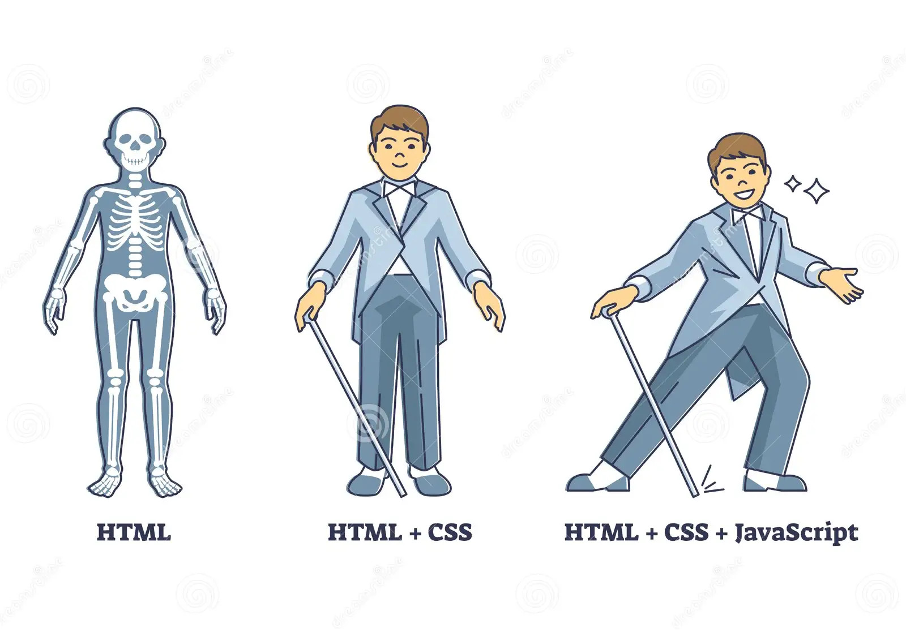
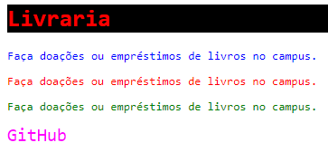
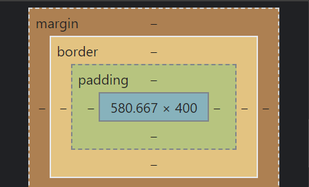

# 1. Introdução a HTML

## Sumário
  - [x] [Introdução ao conteúdo](HTML.md#introdução-ao-conteúdo)
- HTML
  - [x] [Como a internet chega até a sua casa?](HTML.md#como-a-internet-chega-até-a-sua-casa)
  - [x] [O que é o HTML?](HTML.md#o-que-é-o-html)
  - [x] [Estrutura básica](HTML.md#estrutura-básica)
  - [x] [Tags básicas](HTML.md#tags-básicas)
  - [x] [Aninhamento](HTML.md#aninhamento)
  - [x] [Atributos](HTML.md#atributos)
  - [x] [Exemplo](HTML.md#exemplo)
  - [x] [Criando nosso primeiro site com HTML](HTML.md#criando-nosso-primeiro-site-com-html)
  - [x] [Símbolos e Emoji no seu site](HTML.md#símbolos-e-emoji-no-seu-site)
  - [x] [Você tem o direito de usar qualquer imagem no seu site?](HTML.md#você-tem-o-direito-de-usar-qualquer-imagem-no-seu-site)
  - [x] [Como adicionar um favicon ao seu site?](HTML.md#como-adicionar-um-favicon-ao-seu-site)
  - [x] [Como adicionar tabela ao seu site?](HTML.md#como-adicionar-tabela-ao-seu-site)
  - [x] [Elementos de linha e elementos de bloco](HTML.md#elementos-de-linha-e-elementos-de-bloco)
  - [x] [Como adicionar um vídeo ao seu site?](HTML.md#como-adicionar-um-vídeo-ao-seu-site)
  - [x] [Como adicionar um mapa ao seu site?](HTML.md#como-adicionar-um-mapa-ao-seu-site)
  - [x] [Como adicionar um rodapé ao seu site?](HTML.md#como-adicionar-um-rodapé-ao-seu-site)
  - [x] [Metatags para SEO](HTML.md#metatags-para-seo)
  - [x] [Resultado final](HTML.md#resultado-final)
  - [x] [Exercício Prático](HTML.md#exercício-prático)
  - [ ] [Como adicionar áudio ao seu site?](HTML.md#como-adicionar-áudio-ao-seu-site)
  - [ ] [Como adicionar formulário ao seu site?](HTML.md#como-adicionar-formulário-ao-seu-site)
- CSS
  - [x] [O que é CSS?](HTML.md#o-que-é-css)
  - [x] [Inline, Embedding e Import](HTML.md#inline-embedding-e-import)
  - [x] [Selectors](HTML.md#selectors)
  - [x] [Como adicionar espaçamentos?](HTML.md#como-adicionar-espaçamentos)
  - [x] [Especificidade](HTML.md#especificidade)
  - [x] [Box model](HTML.md#box-model)
  

## Introdução ao conteúdo
[&uarr;](#1-introdução-a-html)

As principais tecnologias utilizadas para criar páginas web são o HTML, o CSS e o JavaScript. O HTML é utilizado para estruturar o conteúdo da página. O CSS é utilizado para estilizar o conteúdo da página. O JavaScript é utilizado para adicionar comportamentos ao conteúdo da página. A imagem abaixo ilustra o logotipo do HTML, do CSS e do JavaScript.


> Fonte: <a href="https://apexensino.com.br/wp-content/uploads/2017/11/html-css-javascript.jpg">Apexensino</a>

A diferença entre o HTML, o CSS e o JavaScript é que o HTML é uma linguagem de marcação, o CSS é uma linguagem de estilização e o JavaScript é uma linguagem de programação. A imagem abaixo ilustra a diferença entre o HTML, o CSS e o JavaScript.




> Fonte: <a href="https://thumbs.dreamstime.com/z/html-css-e-javascript-como-camadas-de-codifica%C3%A7%C3%A3o-explica%C3%A7%C3%A3o-diagrama-t%C3%B3picos-explicadas-fases-desenvolvimento-projetos-233593998.jpg">Desamstime</a>

Percebemos na imagem que o HTML é representado como o esqueleto da página, o CSS adiciona cores e estilos ao esqueleto e o JavaScript adiciona comportamentos.

## Como a internet chega até a sua casa?
[&uarr;](#1-introdução-a-html)

A internet é uma rede de computadores que se conectam entre si. Para que você possa acessar a internet, é necessário que o seu computador esteja conectado a essa rede. Existem várias formas de se conectar à internet, como por exemplo, através de um cabo de rede, de uma rede sem fio (Wi-Fi) ou de uma rede de telefonia móvel (3G, 4G, 5G).

Para compreender melhor como a internet funciona, assista ao vídeo abaixo:

[](https://youtu.be/F74GKCLXUWM?t=140 "Como a Internet chega na minha casa?")

## O que é o HTML?
[&uarr;](#1-introdução-a-html)

HTML é a sigla para HyperText Markup Language, que significa Linguagem de Marcação de Hipertexto. O HTML é uma linguagem de marcação utilizada para criar páginas web. O HTML é composto por uma série de elementos, que são representados por tags. As tags são utilizadas para estruturar o conteúdo da página.

> 💡 Para experimentar os exemplos abaixo, crie um novo projeto no Visual Studio Code e crie um arquivo chamado `index.html`. Evite copiar e colar os exemplos abaixo. Digite os exemplos abaixo para praticar. 

> Para criar um novo projeto, faça o seguinte:
> 1. Abra o Visual Studio Code.
> 2. Clique no menu "Arquivo" -> "Abrir Pasta".
> 3. Crie uma pasta chamada `primeiro-projeto`.
> 5. Salve a pasta `primeiro-projeto` dentro da pasta `Documentos`.
> 6. Clique no menu "Arquivo" -> "Novo Arquivo".
> 7. Crie um arquivo chamado `index.html`. O arquivo `index.html` é o arquivo principal do site.
> 8. Clique no menu "Arquivo" e habilite a opção "Salvar automaticamente quando um arquivo for alterado".

Agora você está pronto para começar a escrever o código HTML.
 
### Estrutura básica
[&uarr;](#1-introdução-a-html)


A estrutura básica de um documento HTML é composta por uma tag `<html>`, que contém duas tags: `<head>` e `<body>`. A tag `<head>` é utilizada para adicionar informações sobre o documento, como por exemplo, o título da página. A tag `<body>` é utilizada para adicionar o conteúdo da página. No arquivo `index.html`, digite o código abaixo:

```html
<!DOCTYPE html>
<html lang="pt-br">
    <head>
        <meta charset="UTF-8">
        <title>Título da página</title>
    </head>
    <body>
        <h1>Conteúdo da Página</h1>
        <p>Este é um parágrafo.</p>
    </body>
</html>
```

> 💡 Para ver o resultado, execute a ferramenta `live server` que fica no menu inferior direito do vscode. Por padrão, seu site vai estar disponível no endereço `http://localhost:5000`. `localhost` significa que o projeto está sendo executado no seu computador local e `5000` é o número da porta.

> 💡 Entenda melhor como usar a ferramenta `live server` acessando [Como usar o Live Server de forma ideal](https://blog.cod3r.com.br/como-usar-o-live-server-de-forma-ideal/).

#### Explicando a estrutura básica

 - A tag `<!DOCTYPE html>` é utilizada para informar ao navegador que o documento é um documento HTML. Esta tag deve ser a primeira tag do documento.
 - A tag `<html>` é utilizada para criar o elemento raiz do documento. O elemento raiz do documento é o elemento que contém todos os outros elementos.
 - O atributo `lang` é utilizado para informar ao navegador o idioma do documento.
 - A tag `<head>` é utilizada para criar o cabeçalho do documento. O cabeçalho do documento é a parte invisível da página.
 - A tag `<title>` é utilizada para criar o título do documento. O título do documento é exibido na aba do navegador.
 - A tag `<meta>` é utilizada para adicionar informações adicionais ao documento. O atributo `charset` é utilizado para informar ao navegador o conjunto de caracteres do documento. O conjunto de caracteres é utilizado para exibir caracteres especiais, como por exemplo, acentos.
 - A tag `<body>` é utilizada para criar o corpo do documento. O corpo do documento é a parte visível da página.
 - A tag `<h1>` é utilizada para criar um título. O número indica o nível de importância do título. O número 1 indica que o título é o mais importante. O número 6 indica que o título é o menos importante. 
 - A tag `<p>` é utilizada para criar um parágrafo.

 
### O que é um elemento HTML?

Um elemento HTML é composto por uma tag de abertura, um conteúdo e uma tag de fechamento. O conteúdo é o que está entre a tag de abertura e a tag de fechamento. Por exemplo, o elemento abaixo é composto pela tag de abertura `<p>`, pelo conteúdo "Este é um parágrafo." e pela tag de fechamento `</p>`.

```html
<p>Este é um parágrafo.</p>
```

### Tags básicas
[&uarr;](#1-introdução-a-html)

As tags de título são utilizadas para criar títulos e destacar partes importantes do conteúdo. A tag `h1` é utilizada para criar o título mais importante. A tag `h6` é utilizada para criar o título menos importante.


```html
<h1>Título 1</h1>
<h2>Título 2</h2>
<h3>Título 3</h3>
<h4>Título 4</h4>
<h5>Título 5</h5>
<h6>Título 6</h6>
```

As tags de parágrafo são utilizadas para criar parágrafos. Os parágrafos são utilizados para agrupar frases. O parágrafo, por padrão, é um elemento de bloco, ou seja, ele ocupa toda a largura da página.

```html
<p>Este é um parágrafo.</p>
```

As tags de quebra de linha são utilizadas para criar quebras de linha. As quebras de linha são utilizadas para separar frases. A tag `br` é uma tag vazia, ou seja, ela não possui uma tag de fechamento. 

> 💡 **Importante**: Essa tag não possui conteúdo e não pode ser usada fora do texto.

```html
<p>Este é um parágrafo.<br>Este é outro parágrafo.</p>
```

As tags de ênfase são utilizadas para criar ênfases. As ênfases são utilizadas para destacar partes importantes do conteúdo. A tag `strong` é utilizada para criar ênfases fortes. A tag `em` é utilizada para criar ênfases fracas.

```html
<p>Este é um <strong>parágrafo</strong>.</p>
<p>Este é um <em>parágrafo</em>.</p>
```

As tags de lista são utilizadas para criar listas. As listas são utilizadas para agrupar itens. A tag `ul` é utilizada para criar uma lista não ordenada. A tag `li` é utilizada para criar um item de lista. 

**Importante**: a tag `li` deve ser utilizada dentro da tag `ul`.

```html
<ul>
    <li>Item 1</li>
    <li>Item 2</li>
    <li>Item 3</li>
</ul>
```

As tags de imagem são utilizadas para criar imagens e ilustrar o conteúdo. A tag `img` é uma tag vazia, ou seja, ela não possui uma tag de fechamento. A tag `img` possui dois atributos obrigatórios: `src` e `alt`. O atributo `src` é utilizado para adicionar o endereço da imagem. O atributo `alt` é utilizado para adicionar um texto alternativo à imagem. O texto alternativo é utilizado para descrever a imagem para pessoas com deficiência visual.

**Importante**: A tag `img` é um elemento de linha, ou seja, ela não ocupa toda a largura da página.

```html

```

As tags de âncora são utilizadas para criar links, ou seja, ligações entre páginas. A tag `a` é uma tag de âncora. A tag `a` possui dois atributos obrigatórios: `href` e `alt`. O atributo `href` é utilizado para adicionar o endereço do link. O atributo `alt` é utilizado para adicionar um texto alternativo ao link. O texto alternativo é utilizado para descrever o link para pessoas com deficiência visual.

```html
<a href="https://www.google.com.br" alt="Link para o Google">Google</a>
```

As tags de comentário são utilizadas para criar comentários. Os comentários são utilizados para adicionar informações adicionais ao código que não serão exibidas na página. Os comentários são utilizados para explicar o código e serão ignorados pelo navegador.

```html
<!-- Este é um comentário -->
```

As tags de divisão são utilizadas para criar divisões. As divisões são utilizadas para agrupar elementos e partes de uma página HTML. A tag `div` é um elemento de bloco, ou seja, ela ocupa toda a largura da página.

```html
<div>
    <p>Este é um parágrafo.</p>
    <p>Este é outro parágrafo.</p>
</div>
```

## Aninhamento
[&uarr;](#1-introdução-a-html)

O aninhamento de elementos é utilizado para agrupar elementos, criando estruturas complexas. Por exemplo, o código abaixo cria uma lista de itens com títulos e parágrafos.

```html
<ul>
    <li>
        <h1>Título 1</h1>
        <p>Este é um parágrafo.</p>
    </li>
    <li>
        <h1>Título 2</h1>
        <p>Este é outro parágrafo.</p>
    </li>
</ul>
```

No código acima, cada item `li` possui um título `h1` e um parágrafo `p`. O título e o parágrafo estão aninhados dentro do item da lista. 

## Atributos
[&uarr;](#1-introdução-a-html)

Os atributos são utilizados para adicionar informações adicionais às tags. Os atributos são adicionados na tag de abertura. Por exemplo, o atributo `href` é utilizado para adicionar um link a um elemento. O atributo `src` é utilizado para adicionar uma imagem a um elemento. O atributo `alt` é utilizado para adicionar um texto alternativo a um elemento. O atributo `class` é utilizado para adicionar uma classe a um elemento. O atributo `id` é utilizado para adicionar um identificador a um elemento.

**Importante**: Os atributos `class` e `id` são utilizados para adicionar estilos e comportamentos aos elementos. Esses atributos serão explicados nas próximas aulas.

```html
<a href="https://www.google.com.br">Google</a>

<p class="paragrafo">Este é um parágrafo.</p>
<p id="paragrafo">Este é um parágrafo.</p>
```

## Exemplo
[&uarr;](#1-introdução-a-html)

Nesta aula aprendemos alguns conceitos básicos sobre HTML e suas tags básicas. Aprendemos também a estrutura básica de um documento HTML e como criar títulos, parágrafos, listas, imagens, links, comentários e divisões. Aprendemos também sobre aninhamento de elementos e atributos. Para demonstrar o que aprendemos, vamos criar uma página HTML com uma lista de compras de produtos de supermercado. Cada produto terá um título, uma imagem e um link para o site do supermercado.

```html
<!DOCTYPE html>
<html>
    <head>
        <title>Lista de Compras</title>
    </head>
    <body>
        <h1>Lista de Compras</h1>
        <ul>
            <li>
                <h2>Arroz</h2>
                
                <a href="https://www.paodeacucar.com/produto/563100/arroz-branco-tipo-1-tio-joao-5kg">Comprar</a>
            </li>
            <li>
                <h2>Feijão</h2>
                
                <a href="https://www.paodeacucar.com/produto/563100/arroz-branco-tipo-1-tio-joao-5kg">Comprar</a>
            </li>
            <li>
                <h2>Macarrão</h2>
                
                <a href="https://www.paodeacucar.com/produto/563100/arroz-branco-tipo-1-tio-joao-5kg">Comprar</a>
            </li>
        </ul>
    </body>
</html>
```

## Criando nosso primeiro site com HTML
[&uarr;](#1-introdução-a-html)

Nesta aula, vamos criar nosso primeiro site. O site será uma página de perfil. A página de perfil será composta por uma foto, um nome, uma descrição, um link para o GitHub e uma lista de atividades favoritas. Para criar o site, siga os passos abaixo:

1. Crie uma pasta chamada `primeiro-site` no seu computador.
2. Abra a pasta `primeiro-site` no Visual Studio Code.
3. Crie um arquivo chamado `index.html` dentro da pasta `primeiro-site`. O arquivo `index.html` é o arquivo principal do site.
4. Abra o arquivo `index.html` no Visual Studio Code.

Com o projeto criado, vamos começar a escrever o código HTML. Para isso, siga os passos abaixo:

```html
<!DOCTYPE html>
<html lang="pt-br">
    <head>
        <meta charset="UTF-8">
        <title>Meu Perfil</title>
    </head>
    <body>
        <h1>Meu Perfil</h1>
        
        <h1>Fabricio Bizotto</h1>
        <p>Desenvolvedor de Software</p>
        <a href="https://github.com/fabricioifc" target="_blank">GitHub</a>
        <h2>Lista de Atividades</h2>
        <ul>
            <li>Programar</li>
            <li>Estudar</li>
            <li>Assistir filmes</li>
        </ul>
    </body>
</html>
```

Para melhorar o código acima, vamos separar o conteúdo em seções com a tag `div`. Para isso, siga os passos abaixo:

```html
<!DOCTYPE html>
<html lang="pt-br">
    <head>
        <meta charset="UTF-8">
        <title>Meu Perfil</title>
    </head>
    <body>
        <div>
            <h1>Meu Perfil</h1>
            
        </div>
        <div>
            <h1>Fabricio Bizotto</h1>
            <p>Desenvolvedor de Software</p>
            <a href="https://github.com/fabricioifc" target="_blank">GitHub</a>
            <h2>Lista de Atividades</h2>
            <ul>
                <li>Programar</li>
                <li>Estudar</li>
                <li>Assistir filmes</li>
            </ul>
        </div>
    </body>
</html>
```

## Símbolos e Emoji no seu site
[&uarr;](#1-introdução-a-html)

Para adicionar símbolos e emoji no seu site, você pode utilizar o [Emojipedia](https://emojipedia.org/). Para demonstrar, vamos adicionar um emoji de coração na lista de atividades. Para isso, siga os passos abaixo:

1. Abra o site [Emojipedia](https://emojipedia.org/).
2. Pesquise por "heart".
3. Copie o emoji de coração.
4. Cole o emoji de coração na lista de atividades no exemplo aterior. 

O resultado final deve ser parecido com o código abaixo:

```html
...
<ul>
    <li>❤️ Programar</li>
    <li>❤️ Estudar</li>
    <li>❤️ Assistir filmes</li>
    <li>❤️</li>
</ul>
...
```

## Você tem o direito de usar qualquer imagem no seu site?
[&uarr;](#1-introdução-a-html)

Não. Você não pode usar qualquer imagem no seu site. Você só pode usar imagens que você tem o direito de usar. Por exemplo, você pode usar imagens que você criou ou imagens que você encontrou em sites que permitem o uso comercial. Para encontrar imagens que você pode usar comercialmente, você pode utilizar o [Google Imagens](https://www.google.com.br/imghp?hl=pt-BR&tab=wi&ogbl). Para demonstrar, vamos encontrar uma imagem de um coração no Google Imagens. Para isso, siga os passos abaixo:

1. Abra o site [Google Imagens](https://www.google.com.br/imghp?hl=pt-BR&tab=wi&ogbl).
2. Pesquise por "heart".
3. Clique em "Ferramentas de pesquisa".
4. Clique em "Direitos de uso".
5. Clique em "Marcadas para reutilização com modificação".

O resultado final deve ser parecido com a imagem abaixo:

```html	

```

## Como adicionar um favicon ao seu site?
[&uarr;](#1-introdução-a-html)

Favicon é a sigla para Favorite Icon, que significa Ícone Favorito. O favicon é o ícone que aparece na aba do navegador. 
Para adicionar um favicon ao seu site, você pode utilizar o [Favicon Generator](https://www.favicon-generator.org/). Para demonstrar, vamos adicionar um favicon ao nosso site. Para isso, siga os passos abaixo:

1. Abra o site [Favicon Generator](https://www.favicon-generator.org/).
2. Clique em "Choose File".
3. Selecione a imagem que você quer utilizar como favicon.
4. Clique em "Generate Favicon".
5. Clique em "Download Favicon".
6. Copie o arquivo `favicon.ico` para a pasta do seu site.
7. Adicione a tag `<link rel="icon" href="favicon.ico">` dentro da tag `<head>`.
8. Abra o arquivo `index.html` no navegador.
9. Observe que o favicon aparece na aba do navegador.

O resultado final deve ser parecido com o código abaixo:

```html
<!DOCTYPE html>
<html lang="pt-br">
    <head>
        <meta charset="UTF-8">
        <title>Meu Perfil</title>
        <!-- veja abaixo como adicionar o favicon-->
        <link rel="icon" href="favicon.ico" type="image/x-icon">
    </head>
    <body>
        ...
    </body>
</html>
```

## Como adicionar tabela ao seu site?
[&uarr;](#1-introdução-a-html)

Tabelas em HTML são utilizadas para exibir dados em linhas e colunas. Para demonstrar, vamos alterar o código do nosso site para exibir uma tabela de filmes. Para isso, siga os passos abaixo:

```html
<!DOCTYPE html>
<html lang="pt-br">
    <head>
        ...
    </head>
    <body>
        ...
        <div>
            <h2>Filmes Favoritos</h2>
            <table>
                <thead>
                    <tr>
                        <th>Título</th>
                        <th>Ano</th>
                        <th>Gênero</th>
                    </tr>
                </thead>
                <tbody>
                    <tr>
                        <td>Matrix</td>
                        <td>1999</td>
                        <td>Ficção Científica</td>
                    </tr>
                    <tr>
                        <td>Interestelar</td>
                        <td>2014</td>
                        <td>Ficção Científica</td>
                    </tr>
                    <tr>
                        <td>Star Wars: Episódio IV - Uma Nova Esperança</td>
                        <td>1977</td>
                        <td>Ficção Científica</td>
                    </tr>
                </tbody>
            </table>
        </div>
    </body>
</html>
```

Percebe-se que a tabela é composta por uma tag `<table>`, que contém duas tags: `<thead>` e `<tbody>`. A tag `<thead>` é utilizada para criar o cabeçalho da tabela. A tag `<tbody>` é utilizada para criar o corpo da tabela. O cabeçalho da tabela é composto por uma tag `<tr>`, que contém três tags `<th>`. O corpo da tabela é composto por três tags `<tr>`, que contém três tags `<td>`. A tag `<th>` é utilizada para criar o cabeçalho da coluna. A tag `<td>` é utilizada para criar o conteúdo da célula.

## Elementos de linha e elementos de bloco
[&uarr;](#1-introdução-a-html)

Cada elemento HTML possui um comportamento diferente. Alguns elementos são elementos de linha e outros são elementos de bloco. Os elementos de linha são elementos que não ocupam toda a largura da página. Os elementos de bloco são elementos que ocupam toda a largura da página.

A grande maioria dos elementos HTML são elementos de bloco. Por exemplo, as tags `<h1>`, `<p>`, `<ul>`, `<li>`, `<table>`, `div`, `hr`, `pre` e `blockquote` são elementos de bloco. Poucas tags são elementos de linha. Por exemplo, as tags `<a>`, `<span>`, ``, `<strong>`, `<em>`, `<br>`, `<input>`, `<select>`, `<textarea>` e `<button>` são elementos de linha.

Para demonstrar a diferença entre elementos de linha e elementos de bloco, vamos adicionar mais uma imagem de perfil ao nosso site. Para isso, siga os passos abaixo:

```html
<!DOCTYPE html>
<html lang="pt-br">
    <head>
        ...
    </head>
    <body>
        ...
        <div>
            <h1>Meu Perfil</h1>
            
            
        </div>
        ...
    </body>
</html>
```

Observe que as imagens estão uma ao lado da outra. Para que as imagens fiquem uma abaixo da outra, é necessário alterar a propriedade `display` das imagens para `block`. Isso será feito posteriormente, quando aprendermos sobre CSS.

## Como adicionar um vídeo ao seu site?
[&uarr;](#1-introdução-a-html)

Para adicionar um vídeo ao seu site, você pode utilizar o [YouTube](https://www.youtube.com/). Para demonstrar, vamos adicionar um vídeo ao nosso site. Para isso, siga os passos abaixo:

1. Abra o site [YouTube](https://www.youtube.com/).
2. Pesquise por "fabricio bizotto".
3. Escolha um vídeo. Por exemplo, o vídeo "Programação Web II".
4. Clique no botão "Compartilhar".
5. Clique no botão "Incorporar".
6. Copie o código de incorporação.
7. Cole o código de incorporação no seu site.
8. Abra o arquivo `index.html` no navegador.
9. Observe que o vídeo aparece no seu site.

O resultado final deve ser parecido com o código abaixo:

```html
<!DOCTYPE html>
<html lang="pt-br">
    <head>
        ...
    </head>
    <body>
        ...
        <div>
            <h2>Vídeo</h2>
            <iframe width="560" height="315" src="https://www.youtube.com/embed/5n0sdE5Y3lY" title="YouTube video player" frameborder="0" allow="accelerometer; autoplay; clipboard-write; encrypted-media; gyroscope; picture-in-picture; web-share" allowfullscreen></iframe>
        </div>
    </body>
</html>
```

## Como adicionar um mapa ao seu site?
[&uarr;](#1-introdução-a-html)

Para adicionar um mapa ao seu site, você pode utilizar o [Google Maps](https://www.google.com.br/maps/). Para demonstrar, vamos adicionar um mapa ao nosso site. Para isso, siga os passos abaixo:

1. Abra o site [Google Maps](https://www.google.com.br/maps/).
2. Pesquise por "Instituto Federal Catarinense - Campus Videira".
3. Clique no botão "Compartilhar".
4. Clique no botão "Incorporar um mapa".
5. Copie o código de incorporação.
6. Cole o código de incorporação no seu site.
7. Abra o arquivo `index.html` no navegador.
8. Observe que o mapa aparece no seu site.

O resultado final deve ser parecido com o código abaixo:

```html
<!DOCTYPE html>
<html lang="pt-br">
    <head>
        ...
    </head>
    <body>
        ...
        <div>
            <h2>Mapa</h2>
           <iframe src="https://www.google.com/maps/embed?pb=!1m18!1m12!1m3!1d40216.95482411219!2d-51.154208489782796!3d-27.007716151029644!2m3!1f0!2f0!3f0!3m2!1i1024!2i768!4f13.1!3m3!1m2!1s0x94e14fa5b07c8fd5%3A0xfc69f726d4659812!2sInstituto%20Federal%20de%20Educa%C3%A7%C3%A3o%20Ci%C3%AAncia%20e%20Tecnologia%20Catarinense%20-%20Campus%20Videira!5e0!3m2!1spt-BR!2sbr!4v1691860887844!5m2!1spt-BR!2sbr" width="600" height="450" style="border:0;" allowfullscreen="" loading="lazy" referrerpolicy="no-referrer-when-downgrade"></iframe>
        </div>
    </body>
</html>
```

## Como adicionar um rodapé ao seu site?
[&uarr;](#1-introdução-a-html)

O rodapé é a parte inferior da página. O rodapé é utilizado para adicionar informações adicionais ao site como por exemplo, o nome do autor, licença, data de criação, links para redes sociais, etc. Para demonstrar, vamos adicionar um rodapé ao nosso site. Para isso, siga os passos abaixo:

```html
<!DOCTYPE html>
<html lang="pt-br">
    <head>
        ...
    </head>
    <body>
        ...
        <div>
            <p>&copy; 2023 Fabricio Bizotto</p>
            <p>Licença: MIT</p>
            <a href="https://github.com/fabricioifc" target="_blank">GitHub</a>
        </div>
    </body>
</html>
```

## Metatags para SEO
[&uarr;](#1-introdução-a-html)

SEO é a sigla para `Search Engine Optimization`, que significa Otimização para Mecanismos de Busca. O SEO é utilizado para melhorar o posicionamento de um site nos mecanismos de busca. Para melhorar o posicionamento de um site nos mecanismos de busca, é necessário adicionar metatags ao site. As principais metatags para SEO são: `description`, `keywords`, `author`, `viewport`, `robots` e `charset`. Adicionar estas metatags permitem que o site seja encontrado mais facilmente nos mecanismos de busca.

As metatags são utilizadas para adicionar informações adicionais ao documento. Vejamos alguns exemplos de metatags:

```html
<meta name="description" content="Descrição do documento">
<meta name="keywords" content="Palavras-chave do documento">
<meta name="author" content="Autor do documento">
<meta name="viewport" content="width=device-width, initial-scale=1.0">
<meta name="robots" content="index, follow">
<meta charset="UTF-8">
```

Cada `metatag` possui um significado. Para entender melhor, vamos detalhar abaixo cada uma:

 - A metatag `<meta name="description" content="Descrição do documento">` é utilizada para adicionar uma descrição ao documento. A descrição é utilizada pelos mecanismos de busca para exibir uma descrição do documento nos resultados de busca.
 - A metatag `<meta name="keywords" content="Palavras-chave do documento">` é utilizada para adicionar palavras-chave ao documento. As palavras-chave são utilizadas pelos mecanismos de busca para exibir o documento nos resultados de busca.
 - A metatag `<meta name="author" content="Autor do documento">` é utilizada para adicionar o autor do documento.
 - A metatag `<meta name="viewport" content="width=device-width, initial-scale=1.0">` é utilizada para informar ao navegador que o documento deve ser exibido com a largura do dispositivo e com o zoom inicial de 100%.
 - A metatag `<meta name="robots" content="index, follow">` é utilizada para informar aos mecanismos de busca que o documento deve ser indexado e que os links do documento devem ser seguidos.
 - A metatag `<meta charset="UTF-8">` é utilizada para informar ao navegador o conjunto de caracteres do documento. O conjunto de caracteres é utilizado para exibir caracteres especiais, como por exemplo, acentos.

### Como adicionar metatags ao seu site?

Para adicionar metatags ao seu site, você pode utilizar o [Meta Tag Generator](https://www.metatags.org/). Para demonstrar, vamos adicionar metatags ao nosso site. Para isso, siga os passos abaixo:

> 💡 **Importante**: As metatags devem ser adicionadas dentro da tag `<head>`.

1. Abra o site [Free Meta Tag Generator](https://www.seoptimer.com/meta-tag-generator).
2. Preencha os campos com as informações do seu site.
3. Clique no botão "Generate Meta Tags".
4. Clique no botão "Copy to Clipboard".
5. Cole as metatags no seu site dentro da tag `<head>`.

O resultado final deve ser parecido com o código abaixo:

```html
<!DOCTYPE html>
<html lang="pt-br">
    <head>
        <meta charset="UTF-8">
        <title>Meu Perfil</title>
        <link rel="icon" href="favicon.ico" type="image/x-icon">
        <meta name="title" content="Meu Perfil">
        <meta name="description" content="Meu perfil como professor de informática">
        <meta name="keywords" content="IFC, Professor, Informática, Web Design">
        <meta name="robots" content="index, follow">
        <meta name="author" content="Fabricio Bizotto">
        <meta name="viewport" content="width=device-width, initial-scale=1.0">
    </head>
    <body>
        ...
    </body>
</html>
```

## Resultado Final
[&uarr;](#1-introdução-a-html)

O resultado final deve ser parecido com o código abaixo:

```html
<!DOCTYPE html>
<html lang="pt-br">
    <head>
        <meta charset="UTF-8">
        <title>Meu Perfil</title>
        <link rel="icon" href="favicon.ico" type="image/x-icon">
        <meta name="title" content="Meu Perfil">
        <meta name="description" content="Meu perfil como professor de informática">
        <meta name="keywords" content="IFC, Professor, Informática, Web Design">
        <meta name="robots" content="index, follow">
        <meta name="author" content="Fabricio Bizotto">
        <meta name="viewport" content="width=device-width, initial-scale=1.0">
    </head>
    <body>
        <div>
            <h1>Meu Perfil</h1>
            
        </div>
        <div>
            <h1>Fabricio Bizotto</h1>
            <p>Desenvolvedor de Software</p>
            <a href="https://github.com/fabricioifc" target="_blank">GitHub</a>
            <h2>Lista de Atividades</h2>
            <ul>
                <li>❤️ Programar</li>
                <li>❤️ Estudar</li>
                <li>❤️ Assistir filmes</li>
            </ul>
        </div>
        <div>
            <h2>Filmes Favoritos</h2>
            <table>
                <thead>
                    <tr>
                        <th>Título</th>
                        <th>Ano</th>
                        <th>Gênero</th>
                    </tr>
                </thead>
                <tbody>
                    <tr>
                        <td>Matrix</td>
                        <td>1999</td>
                        <td>Ficção Científica</td>
                    </tr>
                    <tr>
                        <td>Interestelar</td>
                        <td>2014</td>
                        <td>Ficção Científica</td>
                    </tr>
                    <tr>
                        <td>Star Wars: Episódio IV - Uma Nova Esperança</td>
                        <td>1977</td>
                        <td>Ficção Científica</td>
                    </tr>
                </tbody>
            </table>
        </div>
        <div>
            <h2>Vídeo</h2>
            <iframe width="560" height="315" src="https://www.youtube.com/embed/5n0sdE5Y3lY" title="YouTube video player" frameborder="0" allow="accelerometer; autoplay; clipboard-write; encrypted-media; gyroscope; picture-in-picture; web-share" allowfullscreen></iframe>
        </div>
        <div>
            <h2>Mapa</h2>
            <iframe src="https://www.google.com/maps/embed?pb=!1m18!1m12!1m3!1d40216.95482411219!2d-51.154208489782796!3d-27.007716151029644!2m3!1f0!2f0!3f0!3m2!1i1024!2i768!4f13.1!3m3!1m2!1s0x94e14fa5b07c8fd5%3A0xfc69f726d4659812!2sInstituto%20Federal%20de%20Educa%C3%A7%C3%A3o%20Ci%C3%AAncia%20e%20Tecnologia%20Catarinense%20-%20Campus%20Videira!5e0!3m2!1spt-BR!2sbr!4v1691860887844!5m2!1spt-BR!2sbr" width="600" height="450" style="border:0;" allowfullscreen="" loading="lazy" referrerpolicy="no-referrer-when-downgrade"></iframe>
        </div>
        <div>
            <p>&copy; 2023 Fabricio Bizotto</p>
            <p>Licença: MIT</p>
            <a href="https://github.com/fabricioifc" target="_blank">GitHub</a>
        </div>
    </body>
</html>
```

## Exercício Prático
[&uarr;](#1-introdução-a-html)

Crie um site para mostrar os seus filmes e séries favoritas. O site precisa ter:
 - Um título. Utilize a tag `<h1>`.
 - Uma foto de um ator ou atriz. Utiqlize a tag ``.
 - Um parágrafo com o nome do ator ou atriz. Utilize a tag `<p>`. O nome do ator ou atriz deve estar em negrito. Utilize a tag `<strong>`.
 - Uma lista de filmes. Cada filme terá um título, um ano e um gênero. A lista deve ter pelo menos 3 filmes. Utilize as tags `<h1>`, `<ul>`, `<li>`, `<table>`, `<thead>`, `<tbody>`, `<tr>`, `<th>` e `<td>`. 
 - Uma tabela com as suas séries favoritas. Cada série terá um título, um ano e um gênero. A tabela deve ter pelo menos 3 séries. Utilize as tags `<h1>`, `<table>`, `<thead>`, `<tbody>`, `<tr>`, `<th>` e `<td>`.
 - Um vídeo de um trailer de um filme ou série. Utilize a tag `<iframe>`.
  - Um rodapé com o seu nome e link para o seu GitHub. Utilize as tags `<p>` e `<a>`.

# O que é CSS?
[&uarr;](#1-introdução-a-html)

CSS é a sigla para `Cascading Style Sheets`, que significa Folhas de Estilo em Cascata. O CSS é utilizado para adicionar estilos e comportamentos aos elementos HTML. O CSS é utilizado para alterar características e alguns comportamentos dos componentes HTML, tais como, a cor, o tamanho, a fonte, a posição, a visibilidade, a animação, etc.

> 💡 Para experimentar os exemplos abaixo, crie um novo projeto no Visual Studio Code e crie um arquivo chamado `index.html`. Evite copiar e colar os exemplos abaixo. Digite os exemplos abaixo para praticar. 

> Para criar um novo projeto, faça o seguinte:
> 1. Abra o Visual Studio Code.
> 2. Clique no menu "Arquivo" -> "Abrir Pasta".
> 3. Crie uma pasta chamada `segundo-projeto`.
> 5. Salve a pasta `segundo-projeto` dentro da pasta `Documentos`.
> 6. Clique no menu "Arquivo" -> "Novo Arquivo".
> 7. Crie um arquivo chamado `index.html`. O arquivo `index.html` é o arquivo principal do site.
> 8. Abra o projeto no navegador usando a ferramenta `live server`.

### Sintaxe

O CSS é composto por regras. Cada regra é composta por um seletor e um bloco de declarações. O seletor é utilizado para selecionar um ou mais elementos HTML. O bloco de declarações é utilizado para adicionar estilos e comportamentos aos elementos HTML.

```css
seletor {
    propriedade: valor;
}
```

No exemplo acima, o seletor é `seletor` e o bloco de declarações é `propriedade: valor;`. O seletor pode ser um elemento HTML, uma classe ou um id. A propriedade é o estilo ou comportamento que será adicionado ao elemento HTML. O valor é o valor da propriedade.

## Inline, Embedding e Import
[&uarr;](#1-introdução-a-html)

Existem três formas de adicionar CSS ao seu site: inline, embedding e import:
 - **Inline**: O CSS é adicionado diretamente no elemento HTML usando o atributo `style` dentro da tag HTML.
 - **Embedding**: O CSS é adicionado dentro da tag `<style>` dentro da tag `<head>`. 
 - **Import**: O CSS é adicionado em um arquivo externo e importado no HTML pela tag `<link>` dentro da tag `<head>`.

> 💡 A terceira estratégia é a mais indicada. É uma boa prática adicionar o CSS em um arquivo externo.

### Como adicionar CSS inline?

Para adicionar CSS inline, você pode utilizar o atributo `style` dentro da tag HTML. Para demonstrar, vamos adicionar CSS inline ao nosso site. Para isso, siga os passos abaixo:

1. Abra o arquivo `index.html` no Visual Studio Code.
2. Adicione o atributo `style` dentro da tag `<h1>`.
3. Adicione o código CSS dentro do atributo `style`.

O resultado final deve ser parecido com o código abaixo:

```html
<!DOCTYPE html>
<html lang="pt-br">
    <head>
        <meta charset="UTF-8">
        <title>Livraria</title>
    </head>
    <body>
        <h1 style="color: red; background-color: black;">Livraria</h1>
        <p>Faça doações ou empréstimos de livros no campus.</p>
    </body>
</html>
```

Perceba que o resultado final é um título vermelho com fundo preto. Isso acontece porque o atributo `style` adiciona a cor vermelha e o fundo preto ao título.

### Como adicionar CSS na tag `<style>`?

Para adicionar CSS ao seu site, você pode utilizar a tag `<style>`. Para demonstrar, vamos adicionar CSS ao nosso site. Para isso, siga os passos abaixo:

1. Abra o arquivo `index.html` no Visual Studio Code.
2. Adicione a tag `<style>` dentro da tag `<head>`.
3. Adicione o código CSS dentro da tag `<style>`.

O resultado final deve ser parecido com o código abaixo:

```html
<!DOCTYPE html>
<html lang="pt-br">
    <head>
        <meta charset="UTF-8">
        <title>Livraria</title>
        <style>
            h1 {
                color: red;
                background-color: black;
            }
            p {
                color: blue;
                background-color: yellow;
            }
        </style>
    </head>
    <body>
        <h1>Livraria</h1>
        <p>Faça doações ou empréstimos de livros no campus.</p>
    </body>
</html>
```

Perceba que o resultado final é um título vermelho com fundo preto. Isso acontece porque o seletor `h1` seleciona todos os elementos `<h1>` e adiciona a cor vermelha e o fundo preto. O resultado final também é um parágrafo azul com fundo amarelo. Isso acontece porque o seletor `p` seleciona todos os elementos `<p>` e adiciona a cor azul e o fundo amarelo.

### Como adicionar CSS em um arquivo externo?

Para adicionar CSS em um arquivo externo, você pode utilizar a tag `<link>`. Vale ressaltar que é uma boa prática adicionar o CSS em um arquivo externo. Para demonstrar, vamos adicionar CSS em um arquivo externo. Para isso, siga os passos abaixo:

1. Crie um arquivo chamado `estilo.css` dentro da pasta `segundo-projeto`.
2. Mover o código css do exemplo anterior para o arquivo `estilo.css`.
3. Adicione a tag `<link>` com os atributos `rel` e `href` dentro da tag `<head>`. O atributo `rel` deve ter o valor `stylesheet`. O atributo `href` deve ter o valor `estilo.css`.
4. Abra o projeto no navegador usando a ferramenta `live server`.

O resultado final deve ser parecido com o código abaixo:

```css
/* estilo.css */
h1 {
    color: red;
    background-color: black;
}
p {
    color: blue;
    background-color: yellow;
}
```

```html
<!-- index.html -->
<!DOCTYPE html>
<html lang="pt-br">
    <head>
        <meta charset="UTF-8">
        <title>Livraria</title>
        <link rel="icon" href="favicon.ico" type="image/x-icon">
        <meta name="description" content="Livraria do IFC">
        <meta name="keywords" content="IFC, Professor, Informática, Web Design">
        <meta name="robots" content="index, follow">
        <meta name="author" content="Fabricio Bizotto">
        <meta name="viewport" content="width=device-width, initial-scale=1.0">
        
        <!-- Alteração -->
        <link rel="stylesheet" href="estilo.css">
    </head>
    <body>
        <h1>Livraria</h1>
        <p>Faça doações ou empréstimos de livros no campus.</p>
    </body>
</html>
```

## Seletores
[&uarr;](#1-introdução-a-html)

Podemos usar o seletor de elemento, classe e id para selecionar um ou mais elementos HTML. O seletor de elemento seleciona um ou mais elementos HTML. O seletor de classe seleciona um ou mais elementos HTML com a mesma classe. O seletor de id seleciona um elemento HTML com o respectivo id. Para demonstrar, as três formas de selecionar um elemento HTML, vamos adicionar um título, um parágrafo e uma lista ao nosso site. Para isso, siga os passos abaixo:

O seletor de elemento é utilizado para selecionar um ou mais elementos HTML. Como seletor, podemos usar uma `tag`, um `id` ou uma `classe`. Para demonstrar, vamos alterar o código do nosso site para adicionar um estilo ao título, ao parágrafo e ao link. Para isso, siga os passos abaixo:

```css
/* estilos.css */
#main {
    font-family: monospace;
}
#main h1 {
    color: red;
    background-color: black;
}
p.blue {
    color: blue;
}
p.red {
    color: red;
}
p.green {
    color: green;
}
.link {
    color: magenta;
    text-decoration: none;
    font-size: 20px;
}
```

```html
<!-- index.html -->
<!DOCTYPE html>
<html lang="pt-br">
    <head>
        <link rel="stylesheet" href="estilo.css">
    </head>
    <body>
        <div id="main">
            <h1>Livraria</h1>
            <p class="blue">Faça doações ou empréstimos de livros no campus.</p>
            <p class="red">Faça doações ou empréstimos de livros no campus.</p>
            <p class="green">Faça doações ou empréstimos de livros no campus.</p>
            <a class="link" href="#">GitHub</a>
        </div>
    </body>
</html>
```

O resultado esperado deve ser parecido com a imagem abaixo:



Perceba que estamos usando seletores de elemento, classe e id para adicionar estilos ao título, ao parágrafo e ao link. 

 - O seletor `#main` seleciona o elemento com o id `main` e adiciona a fonte `monospace`.
 - O seletor `#main h1` seleciona todos os elementos `<h1>` dentro do elemento com o id `main` e adiciona a cor vermelha e o fundo preto.
 - O seletor `p.blue` seleciona todos os elementos `<p>` com a classe `blue` e adiciona a cor azul. 
 - O seletor `p.red` seleciona todos os elementos `<p>` com a classe `red` e adiciona a cor vermelha. 
 - O seletor `p.green` seleciona todos os elementos `<p>` com a classe `green` e adiciona a cor verde. 
 - O seletor `.link` seleciona todos os elementos com a classe `link` e adiciona a cor magenta, remove o sublinhado e aumenta o tamanho da fonte. Por padrão, os links possuem um sublinhado. Para remover o sublinhado, utilizamos a propriedade `text-decoration` com o valor `none`. Para aumentar o tamanho da fonte, utilizamos a propriedade `font-size` com o valor `20px`.


## Como adicionar espaçamentos?
[&uarr;](#1-introdução-a-html)

Podemos adicionar espaçamentos entre os elementos HTML. Para isso, podemos usar as propriedades `margin` e `padding`. A propriedade `margin` é utilizada para adicionar espaçamento externo. A propriedade `padding` é utilizada para adicionar espaçamento interno. Para demonstrar, vamos adicionar espaçamentos ao nosso site. Para isso, siga os passos abaixo:

> 💡 **Importante**: Nunca use a tag `br` para adicionar espaçamento. A tag `br` é utilizada para quebrar linha. Para adicionar espaçamento, use as propriedades `margin` e `padding`.

```css
/* estilos.css */
#main {
    font-family: monospace;
}
#main h1 {
    color: red;
    background-color: black;
}
p.blue {
    color: blue;
    /* Alteração */
    margin: 10px;
    padding: 10px;
}
p.red {
    color: red;
    /* Alteração */
    margin: 10px;
    padding: 10px;
}
p.green {
    color: green;
    /* Alteração */
    margin: 10px;
    padding: 10px;
}
.link {
    color: magenta;
    text-decoration: none;
    font-size: 20px;
}
```

```html
<!-- index.html -->
<!DOCTYPE html>
<html lang="pt-br">
    <head>
        <link rel="stylesheet" href="estilo.css">
    </head>
    <body>
        <div id="main">
            <h1>Livraria</h1>
            <p class="blue">Faça doações ou empréstimos de livros no campus.</p>
            <p class="red">Faça doações ou empréstimos de livros no campus.</p>
            <p class="green">Faça doações ou empréstimos de livros no campus.</p>
            <a class="link" href="#">GitHub</a>
        </div>
    </body>
</html>
```

Podemos perceber que existe um padrão de 10px para `margin` e `padding` repetindo-se em todos os parágrafos. Para evitar repetição, podemos fazer uma pequena modificação no nosso código. Para isso, siga os passos abaixo:

```css
/* estilos.css */
#main {
    font-family: monospace;
}
#main h1 {
    color: red;
    background-color: black;
}
/* Alteração */
p {
    margin: 10px;
    padding: 10px;
    background-color: #e4e4e4;
}
p.blue {
    color: blue;
}
p.red {
    color: red;
}
p.green {
    color: green;
}
```

Criamos um seletor de parágrafos `p` e adicionamos a propriedade `margin` e `padding`. Agora, todos os parágrafos terão um espaçamento de 10px. Adicionamos também a propriedade `background-color` para adicionar uma cor de fundo. A cor de fundo vai nos auxiliar a visualizar melhor o espaçamento entre os parágrafos.

## Especificidade
[&uarr;](#1-introdução-a-html)

A especificidade é utilizada para determinar qual estilo deve ser aplicado a um elemento HTML. A especificidade é utilizada quando dois ou mais seletores selecionam o mesmo elemento HTML. Para determinar qual estilo deve ser aplicado a um elemento HTML, é necessário verificar a especificidade de cada seletor. O seletor com maior especificidade é o seletor que será aplicado ao elemento HTML.

A especificidade é calculada da seguinte forma:
 - Seletor de elemento: 1 ponto.
 - Seletor de classe: 10 pontos.
 - Seletor de id: 100 pontos.
 - Inline: 1000 pontos.
 - !important: 10000 pontos.

> 💡 Evite usar a propriedade `!important` pois ela irá sobreescrever qualquer estilo.

### ID vs Classe

O seletor de id tem maior especificidade que o seletor de classe. Para demonstrar, vamos adicionar um estilo ao nosso site. Para isso, siga os passos abaixo:

```html
<!DOCTYPE html>
<html lang="pt-br">
    <head>
        <style>
            #paragrafo {
                color: red;
            }

            .azul {
                color: blue;
            }

            .verde {
                color: green;
            }
        </style>
    </head>
    <body>
        <p id="paragrafo" class="azul verde">Um ID contra duas classes</p>
    </body>
</html>
```

**Resultado**: A cor do parágrafo será vermelha. Isso acontece porque o seletor de id tem maior especificidade que o seletor de classe.

> 💡 É importante lembrar que o ID só pode ser usado uma vez por página. Para reutilizar código CSS, use classes.

Experimente remover o seletor de id `#paragrafo` no arquivo `index.html` no exemplo acima. O resultado será um parágrafo verde. Isso acontece porque o seletor de classe `.verde` tem maior especificidade que o seletor de classe `.azul`.

> 💡 Assista ao vídeo sobre [CSS: Seletores e Especificidade](https://youtu.be/dPL23aVRIlc) para saber mais.

## Reset de Estilos
[&uarr;](#1-introdução-a-html)

Todo elemento HTML tem um estilo padrão que é injetado pelo navegador web. O legal é que não existe um padrão entre eles. O Chrome tem seu estilo, o Firefox tem o dele, o Safari e Opera também. Isso pode gerar incompatibilidade com o CSS que você escreve. 

O CSS Reset é uma técnica que serve para evitar esse problema. Você remove ou seta valores para as propriedades dos elementos conforme necessário. Existem várias formas de se fazer um CSS Reset. Para começar, podemos criar um simples reset de estilos. Para isso, siga os passos abaixo:

Basta colocar esse código no início do arquivo de estilos:

```css
/* estilos.css */
* {
    margin: 0;
    padding: 0;
    box-sizing: border-box;
}
```

Pronto, todos (*) os elementos ficarão sem preenchimento e sem margem. Ai é só ir estilizando conforme for necessário.

## Box Model - O modelo em caixa
[&uarr;](#1-introdução-a-html)

O Box Model é utilizado para adicionar espaçamentos externos e internos aos elementos HTML. O Box Model é composto por quatro propriedades: `margin`, `border`, `padding` e `content`. A propriedade `margin` é utilizada para adicionar espaçamento externo. A propriedade `border` é utilizada para adicionar borda. A propriedade `padding` é utilizada para adicionar espaçamento interno. A propriedade `content` é utilizada para adicionar o conteúdo do elemento HTML.

Box Model ajuda a entender como os elementos HTML são renderizados no navegador. Para demonstrar, vamos usar um parágrafo como exemplo:

```html
<!DOCTYPE html>
<html lang="pt-br">
<head>
    <meta charset="UTF-8">
    <meta name="viewport" content="width=device-width, initial-scale=1.0">
    <title>Exemplo Box Model</title>
    <style>
        /* Reset de Estilos */
        * {
            margin: 0;
            padding: 0;
            box-sizing: border-box;
        }

        .box-example {
            width: 300px;
            padding: 20px;
            border: 2px solid #333;
            margin: 30px;
        }

    </style>
</head>
<body>
    <div class="box-example">
        <p>Livraria fantástica.</p>
    </div>
</body>
</html>
```

Nesse exemplo, o parágrafo está contido em uma div com a classe `.box-example`.

- **Conteúdo**: O texto do parágrafo "Livraria fantástica." é o conteúdo do elemento.
- **Preenchimento (Padding)**: O padding (preenchimento) da `div` é definido como `20px`, o que cria um espaço entre o conteúdo (parágrafo) e a borda da caixa.
- **Borda (Border)**: A borda da div é definida como `2px solid #333`, o que cria uma borda sólida de 2px ao redor da caixa.
- **Margem (Margin)**: A margem da div é definida como `30px`, o que cria um espaço entre a div e outros elementos vizinhos.

Assim, o Box Model é a soma de todos esses elementos: `conteúdo + preenchimento + borda + margem`. Isso é ilustrado claramente no exemplo, onde a div contém um parágrafo e todas essas propriedades do Box Model. Para visualizar melhor o Box Model, abra a ferramenta de desenvolvedor do navegador (`atalho F12`) e selecione o parágrafo. O resultado será parecido com a imagem abaixo:



> 💡 Entendendo como funciona o Box Model e o Box Sizing [clicando aqui](https://www.alura.com.br/artigos/entendendo-como-funciona-box-model-e-o-box-sizing).

# Projeto: Livraria
[&uarr;](#1-introdução-a-html)

Vamos usar vários conhecimentos relacionados a HTML e CSS em um projeto prático. O projeto consiste em criar um site para uma livraria. O site deve ter um título, um menu, uma lista de livros e um rodapé. O menu deve ter os links "Início", "Livros", "Autores" e "Contato". A lista de livros deve ter pelo menos 3 livros. Cada livro deve ter um título, um autor, uma imagem e um botão para comprar. O rodapé deve ter o nome do autor e o ano de criação do site. Para isso, siga os passos abaixo:

1. Crie um novo projeto chamado `livraria` no Visual Studio Code.
2. Crie um arquivo chamado `index.html`.
3. Crie um arquivo chamado `estilo.css`.
4. Adicione o código HTML abaixo no arquivo `index.html`.
5. Adicione o código CSS abaixo no arquivo `estilo.css`.
6. Abra o projeto no navegador usando a ferramenta `live server`.

O resultado esperado deve ser parecido com a imagem abaixo:


Vamos começar a criar o site passo a passo. Primeiro, vamos criar o título e o menu. Para isso, siga os passos abaixo:

```html
<!-- index.html -->
<!DOCTYPE html>
<html lang="pt-br">
<head>
    <meta charset="UTF-8">
    <meta name="viewport" content="width=device-width, initial-scale=1.0">
    <title>Livraria</title>
    <link rel="stylesheet" href="estilos.css">
</head>
<body>
    <header>
        <h1>Livraria Fantástica</h1>
        <nav>
            <ul>
                <li><a href="#">Início</a></li>
                <li><a href="#">Livros</a></li>
                <li><a href="#">Autores</a></li>
                <li><a href="#">Contato</a></li>
            </ul>
        </nav>
    </header>
</body>
</html>
```

O código acima começa com a declaração do documento HTML. Em seguida, temos a tag `<head>` com as metatags charset e viewport, o título do site e o link para o arquivo `estilos.css`. Na tag `<body>`, temos o cabeçalho com o título e o menu. O menu é uma lista não ordenada com os links "Início", "Livros", "Autores" e "Contato".

> 💡 A tag `header` é uma tag semântica. As tags semânticas são utilizadas para adicionar significado ao documento. Conheça mais sobre tags semânticas [clicando aqui](https://www.freecodecamp.org/portuguese/news/elementos-semanticos-do-html5-explicados/).

Agora, vamos adicionar o estilo ao nosso site. Para começar, vamos adicionar um reset de estilos. Para isso, siga os passos abaixo:

```css
/* Reset de Estilos */
* {
    margin: 0; /* zerar a margem de todos os elementos */
    padding: 0; /* zerar o espaçamento interno de todos os elementos */
    box-sizing: border-box; /* incluir padding e borda no cálculo do tamanho do elemento */
}
```

O código CSS acima, começa com o reset de estilos com a propriedade `*` que seleciona todos os elementos HTML. O reset de estilos é utilizado para remover os estilos padrões do navegador. Assim, estamos zerando as margens e os espaçamentos dos elementos HTML. 

> 💡 Por padrão, o preenchimento e a borda não são incluídos no cálculo do tamanho do elemento. Isso significa que o tamanho do elemento será a soma do conteúdo e da margem. Para incluir o preenchimento e a borda no cálculo do tamanho do elemento, utilizamos a propriedade `box-sizing` com o valor `border-box`.

O próximo passo será adicionar uma cor de fundo e um tipo de fonte diferente. Faremos isso na tag `body` pois queremos que esses estilos sejam aplicados em todo o site. Para isso, siga os passos abaixo:

```css
body {
    font-family: Arial, sans-serif;
    background-color: #f0f0f0;
}
```

> 💡 Podemos adicionar uma fonte externa ao nosso site. Recomendo usar o Google Fonts para adicionar fontes externas ao seu site. Conheça mais sobre o Google Fonts [clicando aqui](https://fonts.google.com/). Veremos isso mais adiante.

Em seguida, vamos adicionar o estilo ao cabeçalho. Para isso, siga os passos abaixo:

```css
header {
    background-color: #333; /* cor de fundo */
    color: #fff; /* cor do texto */
    text-align: center; /* alinhamento centralizado */
    padding-top: 20px; /* espaçamento interno superior */
    padding-bottom: 20px; /* espaçamento interno inferior */
    padding-left: 20px; /* espaçamento interno esquerdo */
    padding-right: 20px; /* espaçamento interno direito */
}
```

O código acima adiciona uma cor de fundo, uma cor de texto, um alinhamento centralizado e um espaçamento interno de 20px em todas as direções. Para simplificar, podemos usar a propriedade `padding` para adicionar um espaçamento interno de 20px em todas as direções. Para isso, faça a seguinte alteração no código acima:

```css
header {
    background-color: #333;
    color: #fff;
    text-align: center;
    
    /* assim (cima, baixo, esquerda, direita) */
    padding: 20px 20px 20px 20px;
    /* ou 20px em todas as direções */
    padding: 20px;
}
```

> 💡 Tanto `padding` quanto `margin` seguem a mesma lógica (cima, baixo, esquerda, direita).

Nosso cabeçalho está quase pronto. Falta apenas adicionar o estilo ao título e ao menu. Para isso, siga os passos abaixo:

```css
nav ul {
    list-style: none; /* Remove o estilo da lista */
}

nav li {
    display: inline; /* Deixa os itens da lista em linha */
    margin-right: 20px; /* Adiciona um espaçamento de 20px entre os itens da lista */
}

nav a {
    text-decoration: none; /* Remove o sublinhado dos links */
    font-weight: bold; /* Deixa o texto em negrito */
    color: #fff; /* Cor do texto */
}
```

O código acima remove os marcadores da lista, deixa os itens da lista em linha, adiciona um espaçamento de 20px entre os itens da lista, remove o sublinhado dos links, deixa o texto em negrito e adiciona uma cor de texto branca.

Pronto, nosso cabeçalho está pronto. Agora, vamos alterar nosso arquivo `index.html` para adicionar a lista de livros. Para isso, siga os passos abaixo:

```html
<!-- ... -->
<body>
    <header>
        <!-- ... -->
    </header>

    <main>
        <section class="cards">
            <div class="card">
                
                <h2>Livro Incrível</h2>
                <p>Autor: João Silva</p>
                <button>Comprar</button>
            </div>

            <div class="card">
                
                <h2>Livro Fantástico</h2>
                <p>Autor: Maria Santos</p>
                <button>Comprar</button>
            </div>

            <div class="card">
                
                <h2>Aventuras Mágicas</h2>
                <p>Autor: Pedro Almeida</p>
                <button>Comprar</button>
            </div>
        </section>
    </main>
</body>
<!-- ... -->
```

> 💡 Repare que estamos usando mais duas tags semânticas: `main` e `section`. A tag `main` é utilizada para adicionar o conteúdo principal do site. A tag `section` é utilizada para adicionar uma seção do site. Conheça mais sobre tags semânticas [clicando aqui](https://www.freecodecamp.org/portuguese/news/elementos-semanticos-do-html5-explicados/).

O código acima adiciona uma seção com a classe `.cards` e três cartões com a classe `.card`. Cada cartão tem uma imagem, um título, um autor e um botão para comprar. Inicialmente, vamos adicionar uma margem de 20px em todas as direções na tag `main`. Para isso, siga os passos abaixo:

```css
main {
    padding: 20px; /* espaçamento interno */
    overflow: hidden; /* esconde o conteúdo que ultrapassa o tamanho do elemento */
}
```

> 💡 A propriedade `overflow` com o valor `hidden` é utilizada para esconder o conteúdo que ultrapassa o tamanho do elemento. Isso é necessário porque vamos adicionar um estilo de coluna na classe `.card`.

Já que vamos dividir nossa tela em três colunas, vamos adicionar um estilo de coluna na classe `.card`. Cada `.card` terá uma largura calculada da seguinte forma: `33.33% - 20px`. Esse calculo foi feito para descontar a margem de 10px para cima e para baixo. Para isso, siga os passos abaixo:

```css
.card {
    width: calc(33.33% - 20px); /* 33.33% - 20px */
    margin: 10px; /* margem de 10px para cima e para baixo */
    padding: 20px;
    background-color: #fff;
    box-shadow: 0 2px 4px rgba(0, 0, 0, 0.1);
    text-align: center;
    float: left; /* flutua o elemento para a esquerda */
}
```

No código acima, usamos vários conceitos diferentes.

- A largura (`width`) de cada card é calculada da seguinte forma. Primeiro, calculamos 33.33% da largura do elemento pai. Em seguida, subtraímos 20px para adicionar uma margem de 20px entre os cartões. O resultado é uma largura de 33.33% - 20px.
- Adicionamos uma margem de 10px em cada card.
- Adicionamos um espaçamento interno de 20px em todas as direções.
- Adicionamos uma cor de fundo branca.
- Adicionamos uma sombra.
- Centralizamos o texto no card.
- Flutuamos o card para a esquerda. Isso é necessário para encaixar os cards em colunas.

> 💡 A propriedade `float` é utilizada para flutuar o elemento para a esquerda ou para a direita. Isso é necessário para flutuar um card ao lado do outro, já que cada card por padrão ocupa 100% da largura do elemento pai.

Por fim, vamos adicionar o estilo ao rodapé. Para isso, siga os passos abaixo:

```html
<!-- </main -->
    <footer>
        <p>&copy; 2023 Livraria Fantástica | Criado por Seu Nome</p>
    </footer>
<!-- </body> -->
<!-- </html> -->
```

```css
footer {
    background-color: #333;
    color: #fff;
    text-align: center;
    padding: 1rem;
}
```

O código acima adiciona uma cor de fundo, uma cor de texto, um alinhamento centralizado e um espaçamento interno de 1rem em todas as direções.

> 💡 A propriedade `rem` é utilizada para definir o tamanho da fonte. O `rem` é relativo ao tamanho da fonte do elemento `html`. Por padrão, o tamanho da fonte do elemento `html` é `16px`. Isso significa que `1rem` é igual a `16px`. Se o tamanho da fonte do elemento `html` for `20px`, `1rem` será igual a `20px`.

Terminamos nosso projeto. Agora, vamos adicionar o código completo do nosso projeto. Para isso, siga os passos abaixo:

```html
<!DOCTYPE html>
<html lang="pt-br">
<head>
    <meta charset="UTF-8">
    <meta name="viewport" content="width=device-width, initial-scale=1.0">
    <link rel="stylesheet" href="estilos.css">
    <title>Livraria</title>
</head>
<body>
    <header>
        <h1>Livraria Fantástica</h1>
        <nav>
            <ul>
                <li><a href="#">Início</a></li>
                <li><a href="#">Livros</a></li>
                <li><a href="#">Autores</a></li>
                <li><a href="#">Contato</a></li>
            </ul>
        </nav>
    </header>

    <main>
        <section class="cards">
            <div class="card">
                
                <h2>Livro Incrível</h2>
                <p>Autor: João Silva</p>
                <button>Comprar</button>
            </div>

            <div class="card">
                
                <h2>Livro Fantástico</h2>
                <p>Autor: Maria Santos</p>
                <button>Comprar</button>
            </div>

            <div class="card">
                
                <h2>Aventuras Mágicas</h2>
                <p>Autor: Pedro Almeida</p>
                <button>Comprar</button>
            </div>
        </section>
    </main>

    <footer>
        <p>&copy; 2023 Livraria Fantástica | Criado por Seu Nome</p>
    </footer>
</body>
</html>
```

```css
/* Reset de Estilos */
* {
    margin: 0; /* Remove a margem padrão */
    padding: 0; /* Remove o padding padrão */
    box-sizing: border-box; /* Faz com que o padding e a borda não aumentem o tamanho do elemento */
}

body {
    font-family: Arial, sans-serif; /* Define a fonte padrão */
    background-color: #f0f0f0; /* Define a cor de fundo */
}

header {
    background-color: #333; /* Define a cor de fundo */
    color: #fff; /* Define a cor do texto */
    text-align: center; /* Centraliza o texto */
    padding: 1rem; /* Define um espaçamento interno */
}

nav ul {
    list-style: none; /* Remove a bolinha da lista */
}

nav li {
    display: inline; /* Faz com que os itens da lista fiquem na mesma linha */
    margin-right: 20px; /* Define um espaçamento entre os itens */
}

nav a {
    text-decoration: none; /* Remove o sublinhado dos links */
    color: #fff; /* Define a cor do texto */
    font-weight: bold; /* Define o peso da fonte */
}

main {
    padding: 20px; /* Define um espaçamento interno */
    overflow: hidden; /* Faz com que o elemento não ultrapasse o tamanho do pai */
}

.card {
    width: calc(33.33% - 20px); /* 33.33% - 40px */
    margin: 10px; /* Define um espaçamento externo */
    padding: 20px; /* Define um espaçamento interno */
    background-color: #fff; /* Define a cor de fundo */
    box-shadow: 0 2px 4px rgba(0, 0, 0, 0.1); /* Adiciona uma sombra */
    text-align: center; /* Centraliza o texto */
    float: left; /* Faz com que os elementos fiquem na mesma linha */
}

.card img {
    max-width: 100%; /* Define a largura máxima da imagem */
    height: 300px; /* Define a altura da imagem */
}

.card button {
    background-color: #333;
    color: #fff;
    border: none;
    padding: 8px 16px;
    margin-top: 10px;
    cursor: pointer; /* Muda o cursor do mouse */
    transition: background-color 0.3s ease; /* Adiciona uma transição suave */
}

.card button:hover {
    background-color: #555; /* Muda a cor de fundo ao passar o mouse */
}

footer {
    background-color: #333;
    color: #fff;
    text-align: center;
    padding: 1rem;
}
```

Verifique se o resultado final está parecido com a imagem abaixo:


Faça pequenas modificações de estilo no seu projeto. Adicione cores e espaçamentos diferentes. O importante é praticar e se divertir.

# Projeto: Loja KFC
[&uarr;](#1-introdução-a-html)