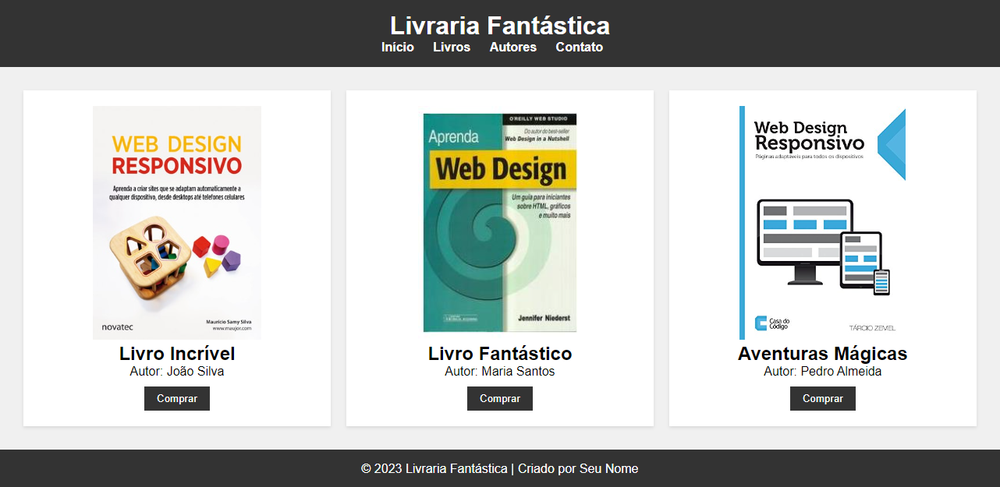
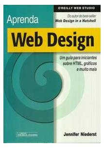

# Projeto: Livraria
[&uarr;](#1-introdução-a-html)

Antes de começar o projeto, vamos criar um novo repositório no GitHub. Para isso, siga os passos abaixo:

1. Faça login na plataforma GitHub. Caso não tenha uma conta, crie uma conta gratuitamente.
2. Crie um novo repositório chamado `livraria`. 
   1. Deixe o repositório público
   2. Marque a opção "Inicializar este repositório com um *README*". 
   3. Clique no botão "Criar repositório".
3. Abra o Visual Studio Code.
   1. Instale a extensão `GitHub CodeSpaces` no Visual Studio Code.
   2. Tecle `Ctrl + Shift + P` para abrir a paleta de comandos.
   3. Digite `Codespaces: Create New Codespace` e tecle `Enter`.
   4. Selecione o repositório `livraria` e tecle `Enter`.
4. Aguarde o Visual Studio Code criar o ambiente de desenvolvimento.
5. Pronto. Agora você está pronto para começar o projeto.

## Desenvolvendo o projeto

Vamos usar vários conhecimentos relacionados a HTML e CSS em um projeto prático. O projeto consiste em criar um site para uma livraria. O site deve ter um título, um menu, uma lista de livros e um rodapé. O menu deve ter os links "Início", "Livros", "Autores" e "Contato". A lista de livros deve ter pelo menos 3 livros. Cada livro deve ter um título, um autor, uma imagem e um botão para comprar. O rodapé deve ter o nome do autor e o ano de criação do site. 

Com o projeto `livraria` aberto no Visual Studio Code, faça:

   1. Crie um novo arquivo chamado `index.html`.
   2. Crie um novo arquivo chamado `estilos.css`.
   3. Crie uma nova pasta chamada `img`.
   4. Abra o projeto no navegador usando a ferramenta `live server`.

A estrutura de pastas e arquivos do projeto terá a seguinte estrutura:

```
livraria
├── img
|   ├── livro-01.jpg
|   ├── livro-02.jpg
|   └── livro-03.jpg
├── index.html
└── estilo.css
```
> 💡 Busque por 3 imagens de livros na internet e salve na pasta `img`.

O resultado esperado deve ser parecido com a imagem abaixo:



Vamos começar a criar o site passo a passo. Primeiro, vamos criar o título e o menu. Para isso, siga os passos abaixo:

```html
<!-- index.html -->

<!DOCTYPE html>
<html lang="pt-br">
<head>
    <meta charset="UTF-8">
    <meta name="viewport" content="width=device-width, initial-scale=1.0">
    <title>Livraria</title>
    <link rel="stylesheet" href="estilos.css">
</head>
<body>
    <header>
        <h1>Livraria Fantástica</h1>
        <nav>
            <ul>
                <li><a href="#">Início</a></li>
                <li><a href="#">Livros</a></li>
                <li><a href="#">Autores</a></li>
                <li><a href="#">Contato</a></li>
            </ul>
        </nav>
    </header>
</body>
</html>
```

O código acima começa com a declaração do documento HTML. Em seguida, temos a tag `<head>` com as metatags charset e viewport, o título do site e o link para o arquivo `estilos.css`. Na tag `<body>`, temos o cabeçalho com o título e o menu. O menu é uma lista não ordenada com os links "Início", "Livros", "Autores" e "Contato".

> 💡 A tag `header` é uma tag semântica. As tags semânticas são utilizadas para adicionar significado ao documento. Conheça mais sobre tags semânticas [clicando aqui](https://www.freecodecamp.org/portuguese/news/elementos-semanticos-do-html5-explicados/).

Agora, vamos adicionar o estilo ao nosso site. Para começar, vamos adicionar um reset de estilos. Para isso, siga os passos abaixo:

```css
/* estilos.css */

/* Reset de Estilos */
* {
    margin: 0; /* zerar a margem de todos os elementos */
    padding: 0; /* zerar o espaçamento interno de todos os elementos */
    box-sizing: border-box; /* incluir padding e borda no cálculo do tamanho do elemento */
}
```

O código CSS acima, começa com o reset de estilos com a propriedade `*` que seleciona todos os elementos HTML. O reset de estilos é utilizado para remover os estilos padrões do navegador. Assim, estamos zerando as margens e os espaçamentos dos elementos HTML. 

> 💡 Por padrão, o preenchimento e a borda não são incluídos no cálculo do tamanho do elemento. Isso significa que o tamanho do elemento será a soma do conteúdo e da margem. Para incluir o preenchimento e a borda no cálculo do tamanho do elemento, utilizamos a propriedade `box-sizing` com o valor `border-box`.

O próximo passo será adicionar uma cor de fundo e um tipo de fonte diferente. Faremos isso na tag `body` pois queremos que esses estilos sejam aplicados em todo o site. Para isso, siga os passos abaixo:

```css
/* estilos.css */

body {
    font-family: Arial, sans-serif;
    background-color: #f0f0f0;
}
```

> 💡 Podemos adicionar uma fonte externa ao nosso site. Recomendo usar o Google Fonts para adicionar fontes externas ao seu site. Conheça mais sobre o Google Fonts [clicando aqui](https://fonts.google.com/). Veremos isso mais adiante.

Em seguida, vamos adicionar o estilo ao cabeçalho. Para isso, siga os passos abaixo:

```css
/* estilos.css */

header {
    background-color: #333; /* cor de fundo */
    color: #fff; /* cor do texto */
    text-align: center; /* alinhamento centralizado */
    padding-top: 20px; /* espaçamento interno superior */
    padding-bottom: 20px; /* espaçamento interno inferior */
    padding-left: 20px; /* espaçamento interno esquerdo */
    padding-right: 20px; /* espaçamento interno direito */
}
```

O código acima adiciona uma cor de fundo, uma cor de texto, um alinhamento centralizado e um espaçamento interno de 20px em todas as direções. Para simplificar, podemos usar a propriedade `padding` para adicionar um espaçamento interno de 20px em todas as direções. Para isso, faça a seguinte alteração no código acima:

```css
/* estilos.css */

header {
    background-color: #333;
    color: #fff;
    text-align: center;
    
    /* assim (cima, baixo, esquerda, direita) */
    padding: 20px 20px 20px 20px;
    /* ou 20px em todas as direções */
    padding: 20px;
}
```

> 💡 Tanto `padding` quanto `margin` seguem a mesma lógica (cima, baixo, esquerda, direita).

Nosso cabeçalho está quase pronto. Falta apenas adicionar o estilo ao título e ao menu. Para isso, siga os passos abaixo:

```css
/* estilos.css */

nav ul {
    list-style: none; /* Remove o estilo da lista */
}

nav li {
    display: inline; /* Deixa os itens da lista em linha */
    margin-right: 20px; /* Adiciona um espaçamento de 20px entre os itens da lista */
}

nav a {
    text-decoration: none; /* Remove o sublinhado dos links */
    font-weight: bold; /* Deixa o texto em negrito */
    color: #fff; /* Cor do texto */
}
```

O código acima remove os marcadores da lista, deixa os itens da lista em linha, adiciona um espaçamento de 20px entre os itens da lista, remove o sublinhado dos links, deixa o texto em negrito e adiciona uma cor de texto branca.

Pronto, nosso cabeçalho está pronto. Agora, vamos alterar nosso arquivo `index.html` para adicionar a lista de livros. Para isso, siga os passos abaixo:

```html
<!-- index.html -->

<!DOCTYPE html>
<html lang="pt-br">
<head>
    <meta charset="UTF-8">
    <meta name="viewport" content="width=device-width, initial-scale=1.0">
    <title>Livraria</title>
    <link rel="stylesheet" href="estilos.css">
</head>
<body>
    <header>
        <h1>Livraria Fantástica</h1>
        <nav>
            <ul>
                <li><a href="#">Início</a></li>
                <li><a href="#">Livros</a></li>
                <li><a href="#">Autores</a></li>
                <li><a href="#">Contato</a></li>
            </ul>
        </nav>
    </header>

    <!-- Conteúdo principal adicionado -->
    <main>
        <section class="cards">
            <div class="card">
                
                <h2>Livro Incrível</h2>
                <p>Autor: João Silva</p>
                <button>Comprar</button>
            </div>

            <div class="card">
                
                <h2>Livro Fantástico</h2>
                <p>Autor: Maria Santos</p>
                <button>Comprar</button>
            </div>

            <div class="card">
                
                <h2>Aventuras Mágicas</h2>
                <p>Autor: Pedro Almeida</p>
                <button>Comprar</button>
            </div>
        </section>
    </main>
</body>
</html>
```

> 💡 Repare que estamos usando mais duas tags semânticas: `main` e `section`. A tag `main` é utilizada para adicionar o conteúdo principal do site. A tag `section` é utilizada para adicionar uma seção do site. Conheça mais sobre tags semânticas [clicando aqui](https://www.freecodecamp.org/portuguese/news/elementos-semanticos-do-html5-explicados/).

O código acima adiciona uma seção com a classe `.cards` e três cartões com a classe `.card`. Cada cartão tem uma imagem, um título, um autor e um botão para comprar. Inicialmente, vamos adicionar uma margem de 20px em todas as direções na tag `main`. Para isso, siga os passos abaixo:

```css
/* estilos.css */

main {
    padding: 20px; /* espaçamento interno */
    overflow: hidden; /* esconde o conteúdo que ultrapassa o tamanho do elemento */
}
```

> 💡 A propriedade `overflow` com o valor `hidden` é utilizada para esconder o conteúdo que ultrapassa o tamanho do elemento. Isso é necessário porque vamos adicionar um estilo de coluna na classe `.card`.

Já que vamos dividir nossa tela em três colunas, vamos adicionar um estilo de coluna na classe `.card`. Cada `.card` terá uma largura calculada da seguinte forma: `33.33% - 20px`. Esse calculo foi feito para descontar a margem de 10px para cima e para baixo. Para isso, siga os passos abaixo:

```css
/* estilos.css */

.card {
    width: calc(33.33% - 20px); /* 33.33% - 20px */
    margin: 10px; /* margem de 10px para cima e para baixo */
    padding: 20px;
    background-color: #fff;
    box-shadow: 0 2px 4px rgba(0, 0, 0, 0.1);
    text-align: center;
    float: left; /* flutua o elemento para a esquerda */
}
```

No código acima, usamos vários conceitos diferentes.

- A largura (`width`) de cada card é calculada da seguinte forma. Primeiro, calculamos 33.33% da largura do elemento pai. Em seguida, subtraímos 20px para adicionar uma margem de 20px entre os cartões. O resultado é uma largura de 33.33% - 20px.
- Adicionamos uma margem de 10px em cada card.
- Adicionamos um espaçamento interno de 20px em todas as direções.
- Adicionamos uma cor de fundo branca.
- Adicionamos uma sombra.
- Centralizamos o texto no card.
- Flutuamos o card para a esquerda. Isso é necessário para encaixar os cards em colunas.

> 💡 A propriedade `float` é utilizada para flutuar o elemento para a esquerda ou para a direita. Isso é necessário para flutuar um card ao lado do outro, já que cada card por padrão ocupa 100% da largura do elemento pai.

Por fim, vamos adicionar o estilo ao rodapé. Para isso, siga os passos abaixo:

```html
<!-- index.html -->

<!DOCTYPE html>
<html lang="pt-br">
<head>
    <meta charset="UTF-8">
    <meta name="viewport" content="width=device-width, initial-scale=1.0">
    <title>Livraria</title>
    <link rel="stylesheet" href="estilos.css">
</head>
<body>
    <header>
        <h1>Livraria Fantástica</h1>
        <nav>
            <ul>
                <li><a href="#">Início</a></li>
                <li><a href="#">Livros</a></li>
                <li><a href="#">Autores</a></li>
                <li><a href="#">Contato</a></li>
            </ul>
        </nav>
    </header>

    <!-- Conteúdo principal adicionado -->
    <main>
        <section class="cards">
            <div class="card">
                
                <h2>Livro Incrível</h2>
                <p>Autor: João Silva</p>
                <button>Comprar</button>
            </div>

            <div class="card">
                
                <h2>Livro Fantástico</h2>
                <p>Autor: Maria Santos</p>
                <button>Comprar</button>
            </div>

            <div class="card">
                
                <h2>Aventuras Mágicas</h2>
                <p>Autor: Pedro Almeida</p>
                <button>Comprar</button>
            </div>
        </section>
    </main>

    <!-- Rodapé adicionado -->
    <footer>
        <p>&copy; 2023 Livraria Fantástica | Criado por Seu Nome</p>
    </footer>
</body>
</html>
```

```css
/* estilos.css */

footer {
    background-color: #333;
    color: #fff;
    text-align: center;
    padding: 1rem;
}
```

O código acima adiciona uma cor de fundo, uma cor de texto, um alinhamento centralizado e um espaçamento interno de 1rem em todas as direções.

> 💡 A propriedade `rem` é utilizada para definir o tamanho da fonte. O `rem` é relativo ao tamanho da fonte do elemento `html`. Por padrão, o tamanho da fonte do elemento `html` é `16px`. Isso significa que `1rem` é igual a `16px`. Se o tamanho da fonte do elemento `html` for `20px`, `1rem` será igual a `20px`.

Terminamos nosso projeto. Agora, vamos adicionar o código completo do nosso projeto. Para isso, siga os passos abaixo:

```html
<!-- index.html -->

<!DOCTYPE html>
<html lang="pt-br">
<head>
    <meta charset="UTF-8">
    <meta name="viewport" content="width=device-width, initial-scale=1.0">
    <link rel="stylesheet" href="estilos.css">
    <title>Livraria</title>
</head>
<body>
    <header>
        <h1>Livraria Fantástica</h1>
        <nav>
            <ul>
                <li><a href="#">Início</a></li>
                <li><a href="#">Livros</a></li>
                <li><a href="#">Autores</a></li>
                <li><a href="#">Contato</a></li>
            </ul>
        </nav>
    </header>

    <main>
        <section class="cards">
            <div class="card">
                
                <h2>Livro Incrível</h2>
                <p>Autor: João Silva</p>
                <button>Comprar</button>
            </div>

            <div class="card">
                
                <h2>Livro Fantástico</h2>
                <p>Autor: Maria Santos</p>
                <button>Comprar</button>
            </div>

            <div class="card">
                
                <h2>Aventuras Mágicas</h2>
                <p>Autor: Pedro Almeida</p>
                <button>Comprar</button>
            </div>
        </section>
    </main>

    <footer>
        <p>&copy; 2023 Livraria Fantástica | Criado por Seu Nome</p>
    </footer>
</body>
</html>
```

```css
/* estilos.css */

/* Reset de Estilos */
* {
    margin: 0; /* Remove a margem padrão */
    padding: 0; /* Remove o padding padrão */
    box-sizing: border-box; /* Faz com que o padding e a borda não aumentem o tamanho do elemento */
}

body {
    font-family: Arial, sans-serif; /* Define a fonte padrão */
    background-color: #f0f0f0; /* Define a cor de fundo */
}

header {
    background-color: #333; /* Define a cor de fundo */
    color: #fff; /* Define a cor do texto */
    text-align: center; /* Centraliza o texto */
    padding: 1rem; /* Define um espaçamento interno */
}

nav ul {
    list-style: none; /* Remove a bolinha da lista */
}

nav li {
    display: inline; /* Faz com que os itens da lista fiquem na mesma linha */
    margin-right: 20px; /* Define um espaçamento entre os itens */
}

nav a {
    text-decoration: none; /* Remove o sublinhado dos links */
    color: #fff; /* Define a cor do texto */
    font-weight: bold; /* Define o peso da fonte */
}

main {
    padding: 20px; /* Define um espaçamento interno */
    overflow: hidden; /* Faz com que o elemento não ultrapasse o tamanho do pai */
}

.card {
    width: calc(33.33% - 20px); /* 33.33% - 40px */
    margin: 10px; /* Define um espaçamento externo */
    padding: 20px; /* Define um espaçamento interno */
    background-color: #fff; /* Define a cor de fundo */
    box-shadow: 0 2px 4px rgba(0, 0, 0, 0.1); /* Adiciona uma sombra */
    text-align: center; /* Centraliza o texto */
    float: left; /* Faz com que os elementos fiquem na mesma linha */
}

.card img {
    max-width: 100%; /* Define a largura máxima da imagem */
    height: 300px; /* Define a altura da imagem */
}

.card button {
    background-color: #333;
    color: #fff;
    border: none;
    padding: 8px 16px;
    margin-top: 10px;
    cursor: pointer; /* Muda o cursor do mouse */
    transition: background-color 0.3s ease; /* Adiciona uma transição suave */
}

.card button:hover {
    background-color: #555; /* Muda a cor de fundo ao passar o mouse */
}

footer {
    background-color: #333;
    color: #fff;
    text-align: center;
    padding: 1rem;
}
```

Verifique se o resultado final está parecido com a imagem abaixo:


## Tarefa

 - [ ] Adicione cores e espaçamentos diferentes.
 - [ ] Adicione mais uma seção com livros dividida em colunas.
 - [ ] Adicione animação nos links do menu.
 - [ ] Adicione uma fonte externa ao seu site.
 - [ ] Publicar seu site no GitHub Pages.
 - [ ] Enviar o link do GitHub Pages no Google Classroom.

O importante é praticar e se divertir!