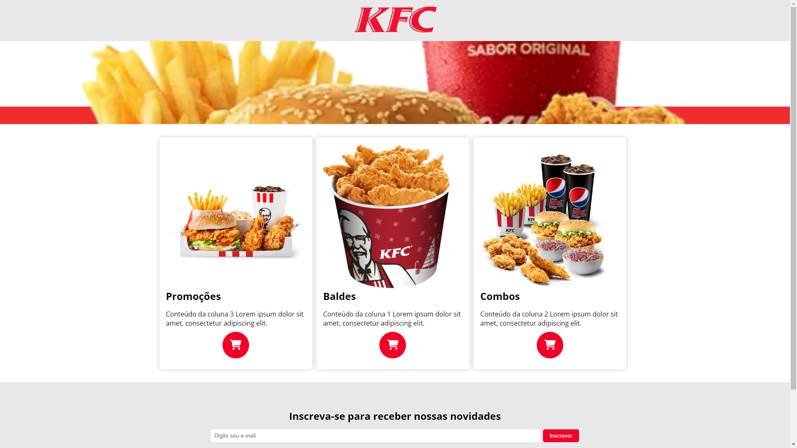
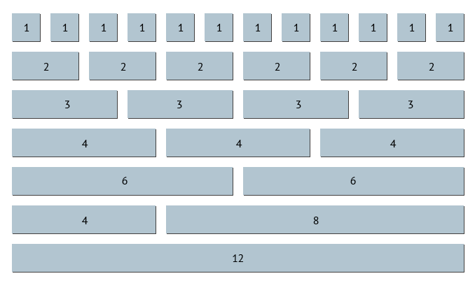

# Projeto: Loja KFC
[&uarr;](#1-introdução-a-html)

Vamos usar vários conhecimentos relacionados a HTML e CSS em um projeto prático. O projeto consiste em criar um site para uma loja de frango frito. O site deve ter um título, um banner, uma lista de produtos em três colunas, um formulário de contato para receber novidades e um rodapé com as redes sociais. Para isso, siga os passos abaixo:

1. Crie um novo projeto chamado `loja-kfc` no Visual Studio Code.
2. Crie um arquivo chamado `index.html`.
3. Crie um arquivo chamado `estilo.css`.
4. Adicione o código HTML abaixo no arquivo `index.html`.
5. Adicione o código CSS abaixo no arquivo `estilo.css`.
6. Abra o projeto no navegador usando a ferramenta `live server`.

A estrutura de pastas e arquivos do projeto terá a seguinte estrutura:

```
loja-kfc
├── img
|   ├── favicon.ico
|   ├── banner.jpeg
|   ├── baldes.png
|   ├── combos.png
|   ├── logo.png
|   └── promocoes.png
├── index.html
└── estilo.css
```

> 💡 As imagens do projeto estão disponíveis na pasta `app/loja-kfc/img`.

Veja o resultado esperado abaixo:



Para começar, vamos começar a criar o site passo a passo. Primeiro, vamos criar a tag `head` e adicionar o título do site e as metatags. Para isso, siga os passos abaixo:

```html
<!DOCTYPE html>
<html lang="pt-br">
<head>
    <meta charset="UTF-8"> <!-- codificação de caracteres -->
    <meta name="viewport" content="width=device-width, initial-scale=1.0"> <!-- responsividade -->
    <meta name="description" content="Uma incrível loja KFC clone"> <!-- descrição do site -->
    <meta name="keywords" content="kfc, frango, exemplo, HTML, CSS"> <!-- palavras-chave -->
    <meta name="author" content="Professor" > <!-- autor do site -->
    <link rel="stylesheet" href="estilos.css"> <!-- link para o arquivo de estilos -->
    <title>Loja</title> <!-- título do site -->
</head>
<body>

</body>
</html>
```

> 💡 Para conhecer mais sobre as metatags, assista ao vídeo [Principais metatags no HTML](https://youtu.be/vfLMKUIEYuk).

Em seguida, vamos adicionar uma novidade. O ícone da aba do navegador, mais conhecido como favicon. Você precisará de uma imagem com o formato `.ico`. Caso não lembre como adicionar o favicon, volte na seção [Como Adicionar um Favicon](HTML.md#como-adicionar-um-favicon-ao-seu-site) e siga os passos novamente.

O resultado será parecido com o código abaixo:

```html
<head>
    <!-- adicionar essa linha -->
    <link rel="shortcut icon" href="img/favicon.ico" type="image/x-icon"> <!-- ícone da aba do navegador -->
</head>
```

> 💡 Para gerar o seu próprio favicon, acesse o site [favicon.io](https://favicon.io/). Escolha um ícone e faça o download. Em seguida, adicione o arquivo `favicon.ico` na pasta `img` do seu projeto. Por fim, adicione o código abaixo na tag `head` do seu arquivo `index.html`.

Pronto. Agora, podemos verificar na aba do navegador se o ícone foi adicionado.

O próximo passo será adicionar o estilo ao nosso site. Para começar, vamos adicionar um reset de estilos. Para isso, siga os passos abaixo:

```css
/* estilos.css */

/* Reset de Estilos */
* {
    margin: 0; /* Remove a margem padrão */
    padding: 0; /* Remove o padding padrão */
    box-sizing: border-box; /* Faz com que o padding e a borda não aumentem o tamanho do elemento */
}
```

Assim como foi feito nos outros projetos, o reset de estilos é importante para remover os estilos padrões do navegador. 

Agora, vamos adicionar uma família de fonte diferente que será importada do Google Fonts. Para isso, siga os passos abaixo:

```css
/* Importar fonte do Google Fonts */
@import url('https://fonts.googleapis.com/css2?family=Open+Sans:wght@400;700&display=swap');

/* Definir fonte padrão */
body {
    font-family: 'Open Sans', sans-serif; /* Define a fonte */
}
```

> 💡 Para conhecer mais sobre o Google Fonts, assista ao vídeo [Como usar o Google Fonts](https://youtu.be/7--Bn9KLRI4).

Vamos adicionar uma imagem de cabeçalho e a imagem de banner. Para isso, siga os passos abaixo:

```html
<body>
    <header>
        <div class="logo">
            
        </div>
    </header>

    <section class="banner"></section>
</body>
</html>
```

Repare que adicionamos uma tag `header` e uma tag `section`. A tag `header` é utilizada para adicionar o cabeçalho do site. A tag `section` é utilizada para adicionar uma seção do site. Na tag `header`, adicionamos uma div com a classe `.logo` e uma imagem com o logo da loja. Na tag `section`, adicionamos uma seção com a classe `.banner`. O resto será feito com CSS.

Agora, vamos adicionar o estilo ao nosso cabeçalho. Para isso, siga os passos abaixo:

```css
/* estilos.css */

header {
    background-color: #e8e8e8; /* Cor de fundo */
    color: #fff; /* Cor do texto */
    text-align: center; /* Alinha o texto ao centro */
    padding: 1rem 0; /* Adiciona um espaçamento interno */
}
```

O código do cabeçalho não tem muito mistério. Adicionamos uma cor de fundo, uma cor de texto, um alinhamento centralizado e um espaçamento interno de 1rem em todas as direções. Agora, vamos adicionar o estilo a imagem de logotipo. Para isso, siga os passos abaixo:

```css
/* estilos.css */

img {
    max-width: 100%; /* Imagens não ultrapassam a largura do elemento pai */
}

.logo img {
    max-width: 200px; /* Imagem da logo não ultrapassa 200px de largura */
}
```

O código acima adiciona um estilo para todas as imagens e um estilo específico para a imagem da logo. Todas as imagens não ultrapassam a largura do elemento pai. A imagem da logo não ultrapassa 200px de largura. Agora, vamos adicionar o estilo ao banner. Para isso, siga os passos abaixo:

```css
/* estilos.css */

.banner {
    background-image: url("img/banner.jpeg"); /* Adiciona a imagem de fundo */
    background-size: cover; /* Redimensiona a imagem para cobrir todo o banner */
    background-position: center; /* Centraliza a imagem */
    text-align: center;
    padding: 100px 0; /* Ajuste o espaçamento interno conforme necessário */
}
```

Na classe `.banner`, adicionamos uma imagem de fundo, redimensionamos a imagem para cobrir todo o banner, centralizamos a imagem, alinhamos o texto ao centro e adicionamos um espaçamento interno de 100px em todas as direções.

A primeira parte do projeto está pronta. Agora, vamos adicionar a lista de produtos. Para isso, siga os passos abaixo:

```html
<!-- index.html -->

<body>
    <header>
        <div class="logo">
            
        </div>
    </header>

    <section class="banner"></section>

    <!-- Seção adicionada aqui -->
    <section id="content">
        <div class="container clearfix">
            <div class="card">
                
                <h2>Promoções</h2>
                <p>Conteúdo da coluna 3 Lorem ipsum dolor sit amet, consectetur adipiscing elit.</p>
                <button>
                    <i class="fa-solid fa-cart-shopping"></i>
                </button>
            </div>
            <div class="card">
                
                <h2>Baldes</h2>
                <p>Conteúdo da coluna 1 Lorem ipsum dolor sit amet, consectetur adipiscing elit.</p>
                <button>
                    <i class="fa-solid fa-cart-shopping"></i>
                </button>
            </div>
            <div class="card">
                
                <h2>Combos</h2>
                <p>Conteúdo da coluna 2 Lorem ipsum dolor sit amet, consectetur adipiscing elit.</p>
                <button>
                    <i class="fa-solid fa-cart-shopping"></i>
                </button>
            </div>
        </div>
    </section>

</body>
</html>
<!-- ... -->
```

O código acima adiciona uma seção com o id `content` e uma div com a classe `container`. Dentro da div com a classe `container`, adicionamos três divs com a classe `card`. Cada div com a classe `card` tem uma imagem, um título, um texto e um botão com um ícone que será adicionado posteriormente com a biblioteca `font awesome`. O resto será feito com CSS.

Para começar a definir os estilos do conteúdo principal do site, vamos adicionar o estilo da nossa classe `.container`. Para isso, siga os passos abaixo:

```css
.container {
    max-width: 1200px; /* Largura máxima do container */
    margin: 0 auto; /* Centraliza o container */
    padding: 2rem; /* Adiciona um espaçamento interno */
}
```

O código acima define a largura máxima do container, centraliza o container e adiciona um espaçamento interno de 2rem em todas as direções. Quando usamos contêiner, é uma boa prática definir uma largura máxima. Isso evita que o conteúdo fique muito largo em telas grandes. Além disso, já que vamos trabalhar com colunas usando a propriedade `float`, precisamos adicionar uma classe `clearfix` na div com a classe `container`. Para isso, siga os passos abaixo:

```css
/* estilos.css */

/* Limpa o float */
.clearfix {
    overflow: auto;
}

.clearfix::after {
    content: ""; 
    display: table; 
    clear: both;
}
```

O código acima adiciona uma classe `clearfix` que limpa o float. Isso é necessário para que o conteúdo não ultrapasse o tamanho do elemento pai. Agora, vamos adicionar o estilo a classe `.card`. Para isso, siga os passos abaixo:

```css
/* estilos.css */

.card {
    background-color: #fff; /* Cor de fundo */
    padding: 1rem; /* Adiciona um espaçamento interno */
    border-radius: 5px; /* Arredonda as bordas */
    box-shadow: 0 0 10px rgba(0,0,0,0.2); /* Adiciona uma sombra */
}
```

Diferentemente das classe `.container` e `.clearfix`, a classe `.card` tem um estilo mais simples. Adicionamos uma cor de fundo, um espaçamento interno, um arredondamento nas bordas e uma sombra.

Com o entendimento da importância das classes `.container` e `.clearfix`, podemos agora trabalhar com a ideia de colunas. Em geral, uma ideia muito utilizada para criar colunas é dividir a nossa tela em 12 pedaços iguais. Assim, podemos dividir a tela em 2 colunas, 3 colunas, 4 colunas, 6 colunas, 12 colunas e assim por diante. Para melhor entendimento, vejamos a imagem abaixo:



A imagem demonstra a divisão da tela em 12 colunas. Cada coluna tem uma largura de 1/12 da largura total da tela. Para implementar essa estratégia e reutilizar ela em nossas páginas web podemos criar classes com o nome `col-1`, `col-2`, `col-3`, `col-4`, `col-6` e `col-12`. Para isso, siga os passos abaixo:

```css
/* estilos.css */

/* Colunas */
/* Alinha as colunas ao lado esquerdo */
[class*="col-"] {
    float: left; 
    margin-right: 10px;
}

/* Calcula a largura da coluna */
.col-1 { width: calc(8.33% - 10px); }
.col-2 { width: calc(16.66% - 10px); }
.col-3 { width: calc(25% - 10px); }
.col-4 { width: calc(33.33% - 10px); }
.col-5 { width: calc(41.66% - 10px); }
.col-6 { width: calc(50% - 10px); }
.col-7 { width: calc(58.33% - 10px); }
.col-8 { width: calc(66.66% - 10px); }
.col-9 { width: calc(75% - 10px); }
.col-10 { width: calc(83.33% - 10px); }
.col-11 { width: calc(91.66% - 10px); } 
.col-12 { width: calc(100% - 10px); }
```

O código acima adiciona um estilo para todas as classes que começam com `col-`. Em seguida, calculamos a largura de cada coluna. Por exemplo, a classe `col-4` tem uma largura de `calc(33.33% - 10px)`. Isso significa que a largura da coluna é igual a 33.33% da largura do elemento pai menos 10px. Isso é necessário para adicionar um espaçamento de 10px entre as colunas. Agora, vamos adicionar o estilo a imagem de cada coluna. Para isso, siga os passos abaixo:

> ⚠️ É fundamental entender essa divisão da tela em 12 pedaços para prosseguir.

Com as colunas definidas no nosso projeto, podemos utilizar as classes `col-4` para adicionar três colunas com a mesma largura. Para isso, vamos fazer uma pequena modificação no nosso código HTML anterior. Para isso, siga os passos abaixo:

```html
<section id="content">
    <div class="container clearfix">
        <!-- Adicionamos a classe col-4 -->
        <div class="card col-4">
            
            <h2>Promoções</h2>
            <p>Conteúdo da coluna 3 Lorem ipsum dolor sit amet, consectetur adipiscing elit.</p>
            <button>
                <i class="fa-solid fa-cart-shopping"></i>
            </button>
        </div>
        <!-- Adicionamos a classe col-4 -->
        <div class="card col-4">
            
            <h2>Baldes</h2>
            <p>Conteúdo da coluna 1 Lorem ipsum dolor sit amet, consectetur adipiscing elit.</p>
            <button>
                <i class="fa-solid fa-cart-shopping"></i>
            </button>
        </div>
        <!-- Adicionamos a classe col-4 -->
        <div class="card col-4">
            
            <h2>Combos</h2>
            <p>Conteúdo da coluna 2 Lorem ipsum dolor sit amet, consectetur adipiscing elit.</p>
            <button>
                <i class="fa-solid fa-cart-shopping"></i>
            </button>
        </div>
    </div>
</section>
```

O código acima adiciona a classe `col-4` em cada div com a classe `card`. Isso significa que cada div com a classe `card` terá uma largura de 33.33% da largura do elemento pai. A soma das três colunas é igual a 100%.

> 💡 É fundamental que a soma das colunas seja igual a `100%`, ou seja, `12 colunas`. <br>
> 💡 **Importante**: Para adicionar mais ou menos colunas, use as classes `col-1`, `col-2`, `col-3`, `col-4`, `col-6` e `col-12`. Por exemplo, se você quiser adicionar 4 colunas iguais, use as classes `col-3`. Se você quiser adicionar 6 colunas, use as classes `col-2`. Se você quiser adicionar 2 colunas, use as classes `col-6`.

Agora, vamos adicionar o estilo a imagem de cada coluna. Para isso, siga os passos abaixo:

```css
/* estilos.css */

.col-image {
    height: 350px; /* Altura da imagem */
    object-fit: cover; /* Redimensiona a imagem para cobrir todo o elemento */
    display: block; /* Faz a imagem ocupar a largura total do elemento pai */
    transition: transform 0.3s ease; /* Adiciona uma transição suave */
}

.col-image:hover {
    transform: scale(1.1); /* Aumenta a imagem em 10% ao passar o mouse */
}
```

Vamos analisar o código acima. Primeiro, definimos uma altura de 350px para a imagem. Essa altura padrão é necessária para evitar que as imagens fiquem com alturas diferentes. Em seguida, usamos a propriedade `object-fit` para evitar que a imagem fique achatada ou esticada pela altura definida de maneira fixa. Usamos também a propriedade `display` para fazer a imagem ocupar a largura total do elemento pai e adicionamos uma transição suave e um efeito de escala ao passar o mouse (propriedade `:hover`).

Agora, vamos adicionar o estilo ao título de cada coluna. Para isso, siga os passos abaixo:

```css
/* estilos.css */

.card h2 {
    font-size: 1.5rem; /* Define o tamanho da fonte */
    margin: 1rem 0; /* Adiciona um espaçamento externo */
}
```

Para finalizar nosso card, vamos adicionar o estilo ao botão de cada coluna. Para isso, siga os passos abaixo:

```css
/* estilos.css */

.card button {
    display: block; /* Faz o botão ocupar a largura total do elemento pai */
    margin: 10px auto; /* Centraliza o botão */
    padding: 0.5rem 1rem; /* Adiciona um espaçamento interno */
    background-color: #F40027; /* Cor de fundo */
    color: #fff; /* Cor do texto */
    border: none; /* Remove a borda */
    cursor: pointer; /* Adiciona o cursor de mão */
    text-decoration: none; /* Remove o sublinhado */
    width: 64px; /* Largura */
    height: 64px; /* Altura */
    border-radius: 50%; /* Arredonda as bordas */
    font-size: 1.5rem; /* Tamanho da fonte */
    transition: transform 0.3s ease; /* Adiciona uma transição suave */
}

.card button:hover {
    background-color: yellow; /* Cor de fundo */
    color: #F40027; /* Cor do texto */
    border: 2px solid #F40027; /* Adiciona uma borda */
    transform: scale(1.1); /* Aumenta o botão em 10% ao passar o mouse */
}
```

Apesar do código do botão ser extendo, não tem muito mistério. Adicionamos um estilo para o botão e um estilo para o botão ao passar o mouse. O botão tem algumas propriedades já conhecidas como largura, algura e margem e outras ainda não exploradas como a propriedade `border-radius` que arredonda as bordas do botão e a propriedade `transform` que adiciona um efeito de escala ao passar o mouse. Além disso, usamos a propriedade `transition` para adicionar uma transição suave. 

Agora, vamos adicionar o estilo ao formulário de contato. Para isso, siga os passos abaixo:

```html
    
    <!-- ... -->

    <section id="newsletter">
        <div class="container clearfix">
            <h2>Inscreva-se para receber nossas novidades</h2>
            <form action="#">
                <input type="email" placeholder="Digite seu e-mail">
                <button type="submit">Inscrever</button>
            </form>
        </div>
    </section>
</body>
</html>
```

O código acima adiciona uma seção com o id `newsletter`. Novamente, estamos reutilizando aqui a classe `container` e a classe `clearfix`. Dentro da div com a classe `container`, adicionamos um título, um formulário e um botão. O resto será feito com CSS.

Antes de verificarmos o CSS, repare que estamos criando um formulário de contato. Para isso, usamos a tag `form` e adicionamos um `input` do tipo `email` e um botão do tipo `submit`. O tipo `email` é utilizado para adicionar um campo de e-mail. O tipo `submit` é utilizado para adicionar um botão de envio. Agora, vamos adicionar o estilo ao formulário de contato. Para isso, siga os passos abaixo:

```css
/* estilos.css */

/* Formulário */
#newsletter {
    background-color: #e8e8e8; /* Cor de fundo */
    text-align: center; /* Alinha o texto ao centro */
    padding: 2rem 0; /* Adiciona um espaçamento interno */
}

#newsletter h2 {
    margin-bottom: 1rem;
}

#newsletter input[type="email"] {
    padding: 0.5rem;
    width: 70%;
    border: none;
    border-radius: 5px;
}

/* Botão */
#newsletter button {
    padding: 0.5rem 1rem;
    color: white;
    background-color: #F40027;
    border: none;
    border-radius: 5px;
    cursor: pointer;
}
```

Novamente, não temos muitas novidades no código acima. Adicionamos um estilo para a seção `#newsletter`, um estilo para o título `h2` e um estilo para o formulário. A novidade aqui fica para o estilo aplicado ao `input` do tipo `email`. Adicionamos um espaçamento interno, uma largura de 70%, uma borda, um arredondamento nas bordas e um cursor de mão.

> 💡 Para conhecer mais sobre os tipos de input, assista ao vídeo [Todos os Tipos de INPUT do HTML e suas FUNÇÕES](https://youtu.be/m_9HufwmmzE).

Para finalizar, vamos adicionar nosso rodapé. Para isso, siga os passos abaixo:

```html

    <!-- ... -->

    <footer>
        <div class="social-icons">
            <a href="#" class="social-icon"><i class="fa-brands fa-facebook"></i></a>
            <a href="#" class="social-icon"><i class="fa-brands fa-x-twitter"></i></a>
            <a href="#" class="social-icon"><i class="fa-brands fa-instagram"></i></a>
            <!-- Adicione mais ícones de redes sociais conforme necessário -->
        </div>
        <p>&copy; 2023 Todos os direitos reservados.</p>
    </footer>
</body>
</html>
```

Nosso rodapé conta com uma div com a classe `social-icons` e uma div com a classe `social-icon`. Dentro da div com a classe `social-icons`, adicionamos três links com a classe `social-icon` e um ícone de rede social. O resto será feito com CSS.

Para adicionar os ícones de redes sociais, vamos utilizar a biblioteca `font awesome`. Para isso, faça a seguinte modificação na tag `head` do seu arquivo `index.html`:

```html
<head>
    <!-- ... -->

    <!-- Adicione essa linha -->
    <link rel="stylesheet" href="https://cdnjs.cloudflare.com/ajax/libs/font-awesome/6.4.2/css/all.min.css" integrity="sha512-z3gLpd7yknf1YoNbCzqRKc4qyor8gaKU1qmn+CShxbuBusANI9QpRohGBreCFkKxLhei6S9CQXFEbbKuqLg0DA==" crossorigin="anonymous" referrerpolicy="no-referrer" />
</head>
```

Pronto. Agora, os ícones das redes sociais presentes em seu rodapé já estão funcionando. Agora, vamos adicionar o estilo ao nosso rodapé. Para isso, siga os passos abaixo:

```css
/* estilos.css */

/* Rodapé */
footer {
    text-align: center;
    padding: 10px 0;
    background-color: #264653;
    color: #fff;
}

/* Links para redes sociais */
.social-icons {
    text-align: center;
    margin: 10px 0;
}

.social-icon {
    display: inline-block;
    margin: 0 10px;
    font-size: 24px;
    color: white;
}
```

O código acima adiciona um estilo para o rodapé, um estilo para os links de redes sociais e um estilo para os ícones de redes sociais. O estilo do rodapé é bem simples. Adicionamos um alinhamento centralizado, um espaçamento interno, uma cor de fundo e uma cor de texto. O resultado será um rodapé simples e elegante.

Para incrementar nosso site, vamos adicionar algumas animações. Para isso, adicione o código abaixo no final do arquivo `estilos.css`.

```css
/* estilos.css */

/* Animações */
@keyframes fade-in {
    0% {
        opacity: 0;
    }
    100% {
        opacity: 1;
    }
}

@keyframes scaleDown {
    0% {
        transform: scale(0);
    }
    100% {
        transform: scale(1);
    }
}
```

O código acima adiciona duas animações. A primeira animação é uma animação de fade-in. A segunda animação é uma animação de escala. Agora, vamos adicionar essas animações no nosso projeto.

Para adicionar a animação de `fade-in`, modifique o código aplicado na tag `body` no arquivo `estilos.css`. Para isso, siga os passos abaixo:

```css
/* estilos.css */

body {
    font-family: 'Open Sans', sans-serif; /* Define a fonte */
    
    /* Adicione essa linha */
    animation: fade-in .5s ease, slide-in 1.2s ease; /* Adiciona animações */
}
```

Para adicionar a animação de escala, modifique o código aplicado na classe `.col-image` no arquivo `estilos.css`. Para isso, siga os passos abaixo:

```css
/* estilos.css */

.col-image {
    height: 350px; /* Altura da imagem */
    object-fit: cover; /* Redimensiona a imagem para cobrir todo o elemento */
    display: block; /* Faz a imagem ocupar a largura total do elemento pai */
    transition: transform 0.3s ease; /* Adiciona uma transição suave */
    
    /* Adicione essa linha */
    animation: scaleDown 1.2s ease; /* Adiciona animações */
}
```

Pronto. Agora, nosso site tem animações. Para finalizar, vamos adicionar um efeito de paralaxe no nosso banner. Para isso, adicione o código abaixo no final do arquivo `estilos.css`.

```css
/* estilos.css */

.banner {
    background-image: url("img/banner.jpeg"); /* Adiciona a imagem de fundo */
    background-size: cover; /* Redimensiona a imagem para cobrir todo o banner */
    background-position: center; /* Centraliza a imagem */
    text-align: center;
    padding: 100px 0; /* Ajuste o espaçamento interno conforme necessário */

    /* Efeito de paralaxe */
    background-attachment: fixed; /* Define o background como fixo */
}
```

Pronto. Agora, nosso site tem um efeito de paralaxe. Para finalizar, vamos adicionar um efeito de rolagem suave. Para isso, adicione o código abaixo no final do arquivo `estilos.css`.

```css
/* estilos.css */

/* Efeito de rolagem suave */
html {
    scroll-behavior: smooth;
}
```

Pronto. Agora, nosso site tem um efeito de rolagem suave. Faça pequenas modificações de estilo no seu projeto. Adicione cores e espaçamentos diferentes. O importante é praticar e se divertir.

Verifique se o resultado final está parecido com a imagem abaixo:

